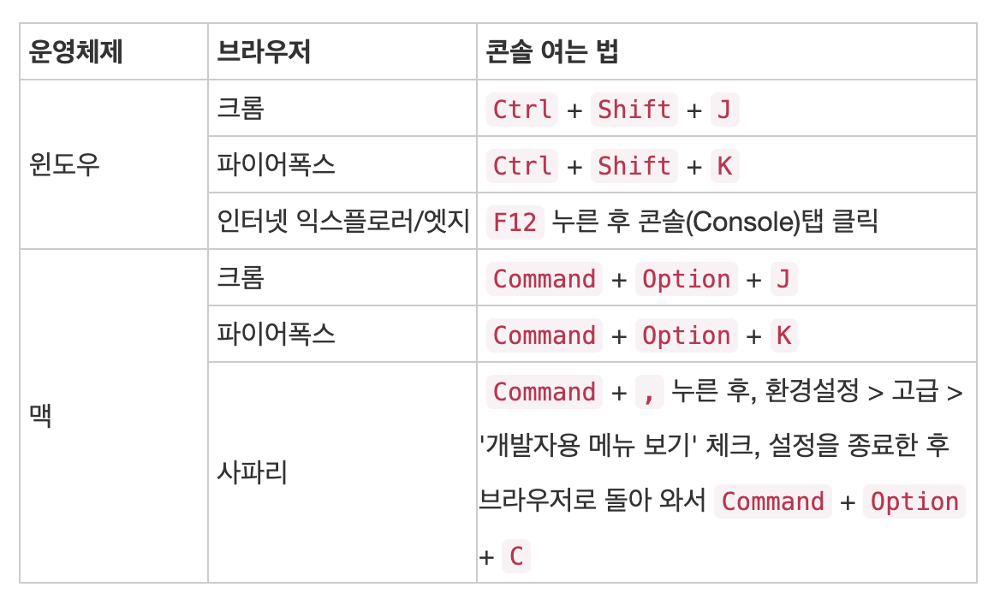

# Problem

- 자바스크립트는 버전별로 어떻게 변화하고 발전해 왔을까요?
    - 자바스크립트의 버전들을 가리키는 ES5, ES6, ES2016, ES2017 등은 무엇을 이야기할까요?
- 웹 브라우저의 자바스크립트 콘솔은 어떻게 사용할까요?
    - 웹 브라우저(Chrome)에서 자바스크립트 콘솔을 띄우는 단축키는 무엇인가요?
- `let`를 이용하여 변수를 선언하는 것과 `const`를 이용하여 변수를 선언하는 것은 어떻게 다를까요?
    - `var`를 이용하여 선언하는 방법은 어떻게 다를까요?
- 자바스크립트의 익명 함수는 무엇인가요?
    - 자바스크립트의 Arrow function은 무엇일까요?

# Answers

> 자바스크립트는 버전별로 어떻게 변화하고 발전해 왔을까요?

1995년, 그 당시의 웹브라우저 시장은 넷스케이프 사의 네비게이터가 지배하고 있었습니다. 하지만 초기의 웹은 변화하지 않는 정적인 글자로 꾸며진 HTML 페이지였고, 넷스케이프 사는 가벼운 프로그램 언어를 통해 HTML 페이지에 움직임을 주고 싶어 프로그램 언어를 추가하기로 결정했습니다. 그래서 **Brendan Erich(브랜든 아이크)**를 고용했는데, 그는 무려 10일 만에 언어를 완성했습니다.

처음에는 `"**JavaScript**"`가 아닌 `"**Mocha**"`라는 이름을 붙였습니다. 하지만 그해 9월, "**LiveScript**"라는 이름으로 바뀌었고 또다시 같은 해 12월, `"**JavaScript**"`로 최종 결정되었습니다. `Java`와 구문이 유사해서 이름을 `JavaScript`로 지었다는 표면상의 이유고, 당시 Java의 유명세를 이용해 마케팅 차원에서 의도적으로 지은 것입니다.

앞선 강의에서 자바스크립트에 대해 설명했듯이, 자바스크립트가 나오면서 웹 문서의 내용을 동적으로 바꾸거나 각종 이벤트를 적용하는 것이 가능해졌습니다.

## ECMA Script

1990년대 Netcape는 `Javascript`를, MS사의 IE에서는 `JScript`를 사용했고 두 스크립트는 제각각이였기 때문에 표준이 필요하여 생긴것이 `ECMA` 입니다.

`ECMA(European Computer Manufactures Association)`의 약자로 ECMAScript는 `Javascript` 언의 표준입니다.

### ES5 (2009)

- 배열 forEach, map, filter, reduce, some Method 추가
- 객체 Object에 대한 getter/setter 추가
- bind Method 추가
- strict moce 추가
- es5-shim 사용 시 하위 버전에서 특정 기능 지원

### ES6 (2015)

- `let` , `const` 키워드 추가
- Arrow 문법 지원
- iterator, generator 추가
- module import, export 추가
- callback hell을 해결할 Promise 추가
- MS에서도 최대한 ECMAScript를 따르는 브라우져 IE Edhe 발표

### ES7 (2016)

- 제곱연산자 (**) 추가
- Array.includes 추가

### ES8 (2017)

- async/await 추가
- 이후 나오는 표준은 EX.Next라고 함

---

> 웹 브라우저의 자바스크립트 콘솔은 어떻게 사용할까요?

브라우저마다 차이가 있습니다.



웹 브라우저 콘솔은 퍼블리싱작업시, 스타일 값을 미리 넣어서 테스트 해 볼수 있습니다. 또한 HTML코드를 볼 수 있어 크롤링 작업이나 local Storage나 session Storage 같은 것을 이용해서 미리 초기값을 넣어두거나 세션의 상태를 확인할 수 있습니다.

> `let` 를 이용하여 변수를 선언하는 것과 `const` 를 이용하여 변수를 선언하는 것은 어떻게 다를까요?

### var, let, const

먼저 `var` 를 이용한 변수 선언 방식에 대해서 알아 보겠습니다.

```jsx
var name = 'knowre';
console.log(name);  // knowre

var name = 'Yunmin'
console.log(name);  // Yunmin
```

`name` 이란 변수명을 두번 선언 했음에도 불구하고 에러가 나오지 않고 각기 다른 값이 출력되는 것을 알 수 있습니다.

시각에 따라 '유연한 변수 선언' 이라고 생각하여 간단한 테스트에는 편할 수 있지만, 코드량이 많아 진다면 어디서 어떻게 사용되는지도 파악하기 힘들 수 있고, 변수명 중복으로 인해 값이 바뀔 수 있는 위험이 있습니다.

그래서 ES6이후 이를 보완하기 위해 추가된 선언 방식이 `let` 과 `const` 입니다.

### let과 const의 차이점

위 문법을 `let` 문법을 사용하여 똑같이 실행한다면,

```jsx
let name = 'knowre';
console.log(name);  // knowre

let name = 'Yunmin'
console.log(name);  // SyntaxError : Identifier 'name' has already been declared
```

`name` 이 이미 선언되었다는 에러 메세지가 나옵니다. 이는 `const` 도 마찬가지 입니다.

즉, 변수 재선언이 되지 않습니다.

`let` 과 `const` 의 차이점은 불변성(immutable) 여부 입니다.

```jsx
let name = 'knowre';
console.log(name);  // knowre

let name = 'Yunmin'
console.log(name);  // SyntaxError : Identifier 'name' has already been declared

name = 'Song'
console.log(name) // Song
```

위와 같이 let은 변수에 재할당이 가능합니다.

```jsx
const name = 'knowre';
console.log(name);  // knowre

const name = 'Yunmin'
console.log(name);  // SyntaxError : Identifier 'name' has already been declared

name = 'Song'
console.log(name) // TypeError : Assignment to constant variable
```

const는 변수 재선언, 변수 재할당 모두 불가능하다.

또한 `var` 키워드와 달리 `let` 키워드는 호이스팅이 발생하지 않습니다.

변수는 `선언 단계`, `초기화 단계`, `할당 단계` 를 거쳐서 생성되는데, `var` 로 선언된 변수는 `선언 단계`와 `초기화 단계`가 한번에 이루어 집니다.

```jsx
// Scope 선두에서 선언 단계 및 초기화 단계 실행
// 변수 선언문 이전에 변수를 참조할 수 있음
console.log(name);  // undefind

var name;
console.log(name);  // undefind

name = 'Yunmin'     // 할당 단계
console.log(name);  // Yunmin
```

하지만 let으로 선언된 변수는 선언 단계와 초기화 단계가 분리되어 진행 됩니다.

```jsx
// Scope 선두에서 선언 단계가 실행
console.log(name); // ReferenceError : name is not defined

let name;   // 초기화 단계 실행
console.log(name);  // undefined

name = 'Yunmin';    // 할당 단계
console.log(name);  // Yunmin
```

즉, 변수 선언에는 기본적으로 `const` 를 사용하고, 재할당이 필요한 경우에만 `let` 을 사용하는 것이 좋습니다.

또한 객체를 재할당하는 경우는 생각보다 흔하지 않습니다. `const` 를 사용하면 의도치 않은 재할당을 방지해 주기 때문에 보다 안전합니다.

> 자바스크립트의 익명 함수는 무엇인가요?

익명함수는 함수에 이름이 없기 때문에 변수에 넣어서 사용하는 함수입니다.

변수에는 숫자, 문자도 들어갈 수 있지만 함수도 들어갈 수 있습니다.

```jsx
let func = function(){
	// Code
}
func();  // 함수 호출
```

선언적 함수와 익명 함수의 차이점은 **웹 브라우저가 script태그 내부의 내용을 위에서 한줄 씩 읽기 전에 선언적 함수부터 먼저 읽는다는 것입니다.**

```jsx
<script>
	func();
	let func() = function() {alert('function A')};  // Error!
</script>
```

이 코드가 에러가 나는 이유는 **익명함수를 저장한 변수를 선언하기 전에 그 변수를 사용했기 때문**입니다.

```jsx
<script>
	func();
	function func() {alert('function A'));
</script>
```

이 코드가 에러가 나지 않는 이유는 웹 브라우저가 코드를 읽을 때는 위에서 부터 차례로 읽긴하지만, **선언적 함수가 있으면 그 코드부터 먼저 읽은 뒤에 차례로 읽어 나가기 때문**입니다.

## JS Arrow Function

Arrow Function은 ES6 문법입니다. `function` 키워드를  사용해서 함수를 정의하는 방법보다 훨씬 간단하게 함수를 표현할 수 있습니다.

**또한 화살표 함수는 항상 익명함수입니다.**

```jsx
// General Function
let func =  function() {console.log("func"}};

// Arrow Function
let func2 = () => console.log("func2");
```

## Arrow Function grammar

```jsx
// 매개변수가 없는 경우
let func = () => console.log('yun');
func();  // yun

// 매개변수가 하나 있는 경우
let func = x => console.log(x);
func('hi'); // hi

// 매개변수가 여러개인 경우
let func = (a, b) => { return a + b };
func(1, 2)  // 3

// {} 를 사용했는데 return 값이 없을 때
let func = (a, b) => { a + b };
func(2, 3);  // undefined

```