# git의 내부구조와 동작 원리

## git의 내부구조 이해하기

git은 어떻게 버전관리를 할까요? git의 내부는 일종의 단순한 key-value 데이터베이스 입니다. git 프로젝트의 `.git` 디렉토리 안에는 git이 버전관리에 필요한 데이터들이 저장 됩니다.

### Content-addressable Key-Value Storage

git은 버전 관리에 필요한 데이터를 Key-Value 형태의 Object로 변환합니다. 이때 key는 데이터를 SHA-1 알고리즘을 이용한 체크섬이 되고 Value는 데이터를 zlib 으로 압축한 값이 됩니다.

SHA-1 해시를 사용하여 체크섬을 생성하면 체크섬은 160비트가 되고 16진수로 표현하면 40자리의 문자열이 됩니다. (ex: 43d5a8ed6ef6c00ff775008633f95787d088285d)

git은 이 40자리 문자열 중에 앞의 2자리는 디렉토리 명으로 나머지 38자리는 파일명으로 사용합니다.


즉, git은 원본 데이터의 **체크섬을 파일명**으로 원본 데이터를 **zlib 압축한 값을 파일데이터**로 저장하고 이를 object라고 합니다.

> git은 타입을 나타내는 헤더와 내용을 합쳐 SHA-1 체크섬을 계산 합니다.

### git cat-file

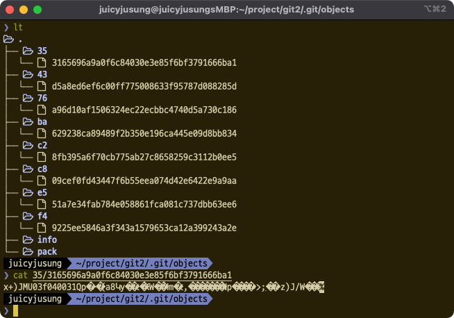

object의 내용을 보면 zlib으로 압축되어 있기 때문에 내용을 바로 확인할 수 없습니다. `git cat-file` 커맨드를 사용하면 오브젝트의 타입과 내용을 확인할 수 있습니다.
```shell
# 타입
git cat-file -t <object>
    
# 내용
git cat-file -p <object>
```

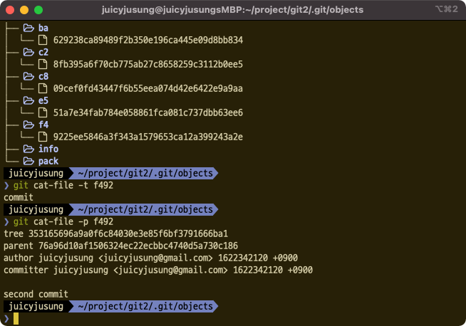

## Objects

위에서 말한 object는 버전 관리를 하게 될 리소스만을 의미 하는것은 아닙니다. git은 4가지의 데이터를 object화 시켜 `.git/objects` 하위에 저장합니다.

- blob object
- tree object
- commit object
- tag object

### Blob object
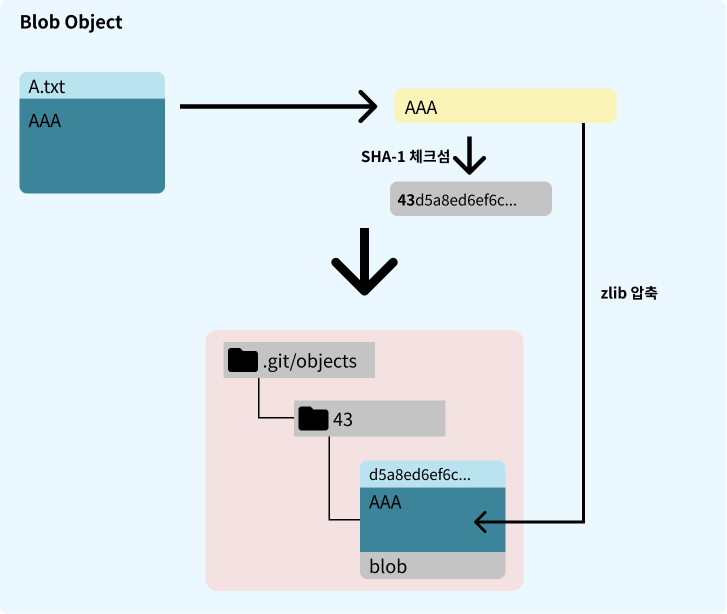
Blob object는 프로젝트에서 버전 관리하는 파일의 데이터입니다.

AAA의 내용을 갖는 `A.txt` 를 생성하고 커밋을 하게 되면 Blob object가 저장됩니다.

git은 스냅샷 기반의 VCS입니다. [VCS 스냅샷과 델타 (feat. git)](./vcs.md)

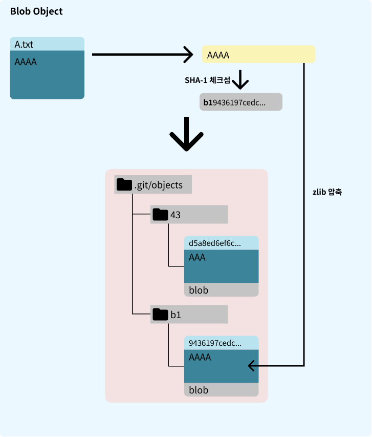

만약 `A.txt`를 AAAA로 수정하고 커밋하게 된다면 위와 같이 새로운 Blob object가 생성됩니다.

즉, git은 파일의 각 버전을 Blob object로 저장하게 됩니다.

### Tree object

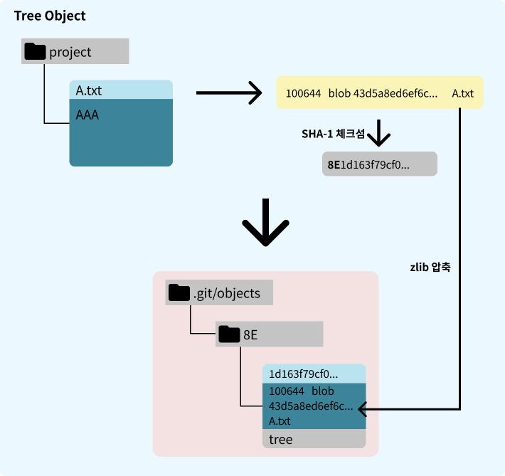

Tree object를 한마디로 표현하자면 상태(버전을)를 갖는 디렉토리 트리 노드입니다. 루트 디렉토리에서 부터 시작해서 각 디렉토리가 갖고있는 **Blob object**와 또 다른 디렉토리인 **Tree object**가 생성됩니다.

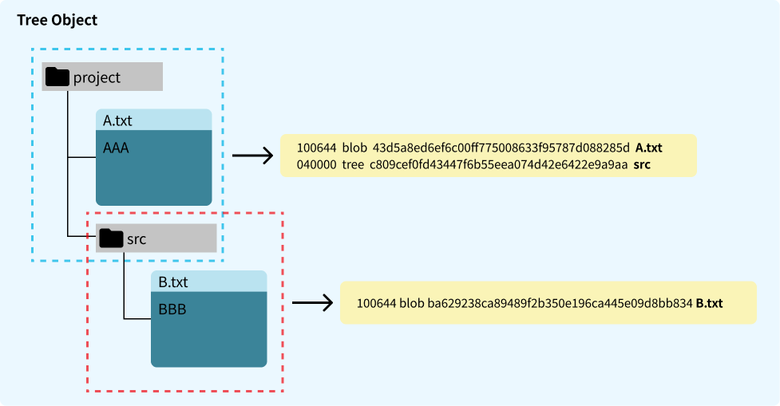

Blob object를 다시 보면 Blob object는 파일명을 갖고 있지 않고 데이터만 갖고 있습니다. Tree object는 어떤 버전의 데이터와 하위 트리노드를 갖고 있는지 프로젝트의 구조를 만들어 줍니다.

즉, 루트 Tree object만 알면 해당 버전의 파일셋을 만들 수 있습니다.

### Commit object

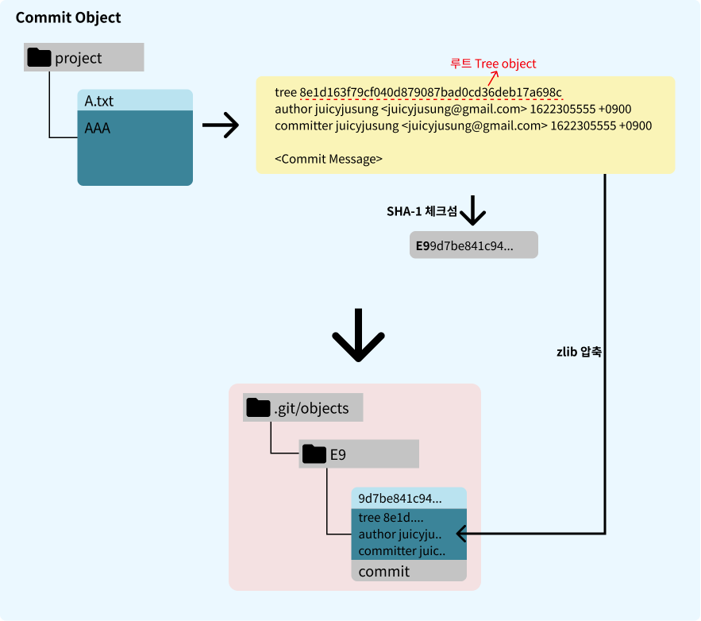

Tree object를 설명하면서 마지막에 루트 Tree object를 알면 특정 버전을 구성할 수 있다고 했습니다. Commit object는 커밋에 대한 정보와 해당 커밋의 루트 Tree object에 대한 정보를 저장합니다. 스냅샷을 누가, 언제, 왜 저장했는지에 대한 정보는 아예 없다. 이런 정보는 커밋 개체에 저장된다.

만약 부모 커밋이 존재한다면 아래와 같이 부모 커밋의 체크섬키가 포함 됩니다.

```shell
tree 353165696a9a0f6c84030e3e85f6bf3791666ba1
parent 76a96d10af1506324ec22ecbbc4740d5a730c186
author juicyjusung <juicyjusung@gmail.com> 1622342120 +0900
committer juicyjusung <juicyjusung@gmail.com> 1622342120 +0900
```

## Git Refs

objects를 정리해 봅시다.

- 새로운 파일 혹은 변경된 파일이 커밋 되었을경우 Blob object 생성
- 커밋된 스냅샷의 Hierarchy 구조를 그리는 Tree object 생성
- 커밋 정보와 해당 스냅샷의 루트 트리 노드키를 포함하는 Commit object 생성

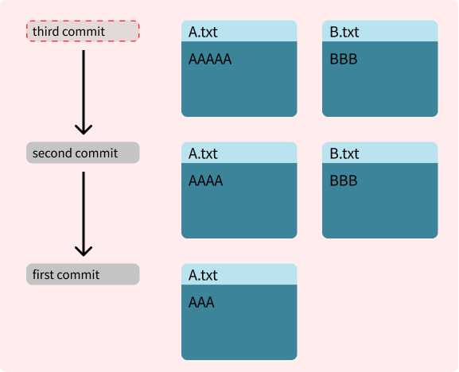

정리한 내용을 토대로 우리는 원하는 버전의 Commit object의 체크섬만 알고 있으면 해당 버전을 구성할 수 있습니다. 또한, Commit object는 부모 커밋의 체크섬도 가지고 있으므로 현재 Commit object 까지의 일련의 스냅샷 히스토리를 추적할 수 있습니다.

git의 모든 object는 SHA-1 값을 사용합니다. 인간의 입장에서 SHA-1 값은 직관적이지 않습니다. 만약 Commit object를 가르키는 쉬운 이름으로 된 포인터가 있으면 어떨까요? 우리는 그 이름만으로 해당 커밋의 스냅샷 혹은 그 커밋까지의 히스토리를 조회할 수 있습니다. git은 이런 것들을 "Refs"라 부릅니다. Refs는 .git/refs 하위에 구성됩니다.

### refs/heads - branch
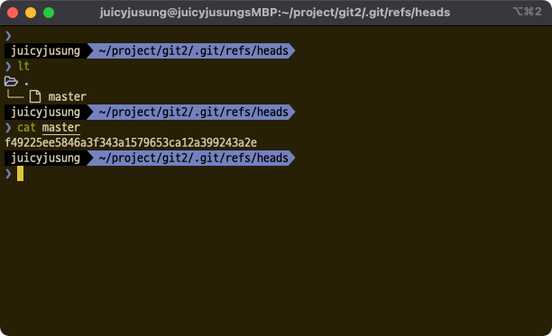
특정 커밋을 가리키는 알기 쉬운 이름의 포인터가 추적하기 원하는 스냅샷의 흐름의 가장 마지막 커밋을 가리키면 어떨까요? 이것이 우리가 사용하는 깃의 브랜치 입니다.

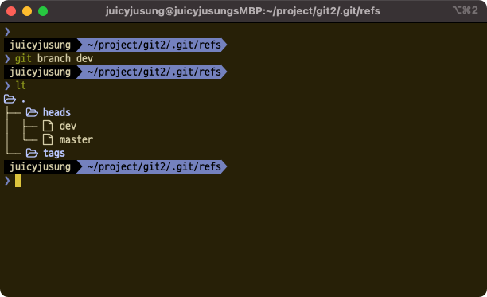

브랜치를 생성하면 `.git/refs/heads` 에 refs가 생성 됩니다.

### refs/tag

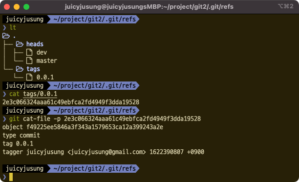

Objects 섹션에서 설명을 하지 않은 마지막 object가 있습니다. 바로 Tag object입니다. Tag object는 누가, 언제 태그를 달았는지 태그 메시지는 무엇이고 어떤 커밋을 가리키는지에 대한 정보가 포함됩니다. 얼핏 보면 특정 버전을 구성할 수 있는 Commit object와 비슷해 보이지만 Tag object는 Tree object가 아니라 Commit object를 가리키는 것이 그 둘의 차이입니다.

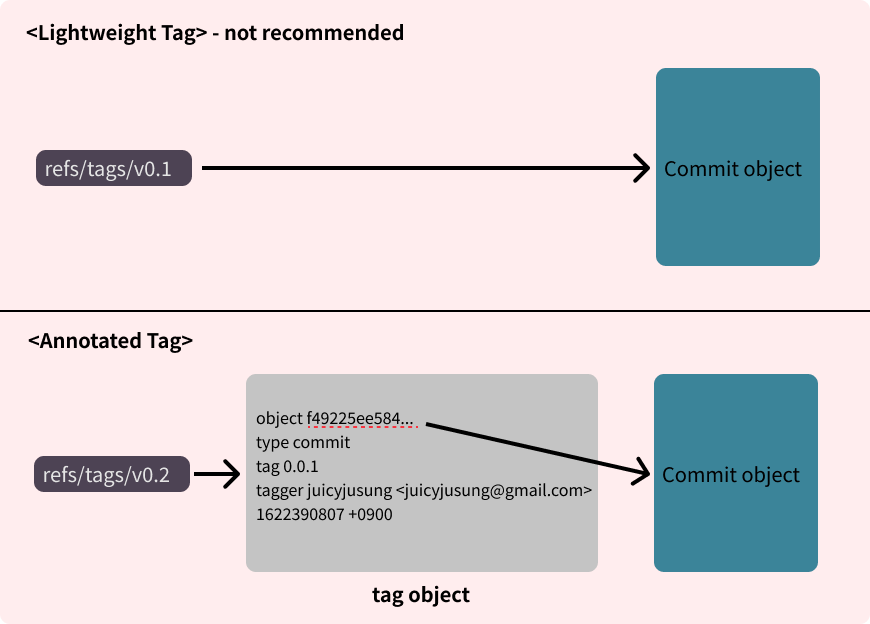

태그는 Lightweight tag와 Annotated tag 두 종류가 있습니다. 이 둘의 차이는 위의 그림과 같이 Lightweight tag는 Commit object를 바로 가리키고, Annotated tag는 Tag object를 가리킵니다.

### HEAD

커밋을 하거나 새로운 브랜치를 생성할 때 기준이 되는 커밋을 어떻게 알 수 있을까요?

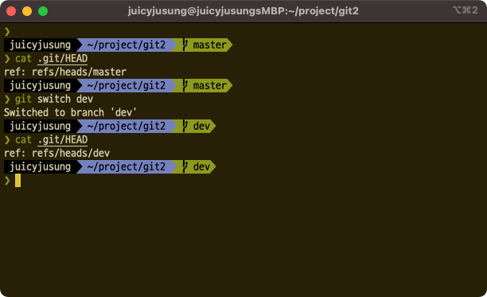

git은 `.git/HEAD` 에 현재 기준이되는 refs값을 기록 합니다.

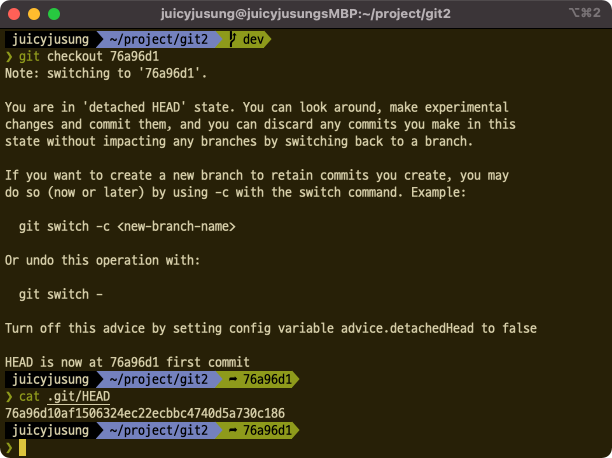

일반적으로는 브랜치의 refs 값을 갖겠지만 SHA-1 값으로도 사용할 수 있습니다. HEAD를 refs가 아닌 다른 커밋의 SHA-1로 설정하고 커밋을 하면 어떻게 될까요?

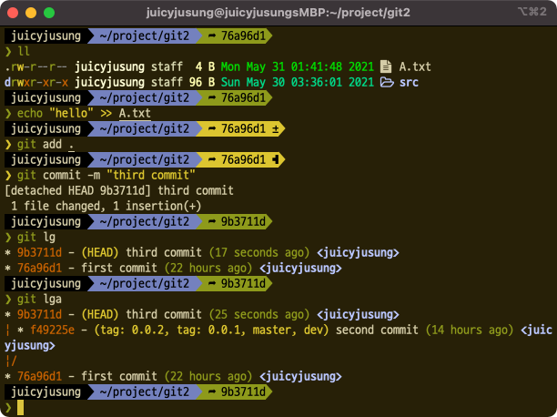

위의 그림과 같이 `76a96d1` 커밋을 HEAD로 설정하고 새로운 커밋을 하면 새로운 커밋 `9b3711d`의parent가 HEAD에 있던 `76a96d1` 가 되는 것을 알 수 있고, 이것은 커밋을 할 때 HEAD의 커밋이 기준이 된다는 것을 알 수 있습니다.

## 마치며

이로서 우리는 git의 내부와어떤식으로 동작하는지 이해하게 되었습니다. git은 변경사항이 있으면 완전히 새로운 Blob object를 생성하기 때문에 최적화를 위해 적절한 시점(Loose 객체가 너무 많을 때, Push할 때, `git gc` 커맨드를 실행할 때)에 델타화 및 압축을 실행합니다 (참고: [Packfiles](https://git-scm.com/book/en/v2/Git-Internals-Packfiles)). 이런 시스템을 뚝딱 만든 토르발즈가 경이롭고 멋진것 같습니다.

## 참고
[Git - Book](https://git-scm.com/book/en/v2)
