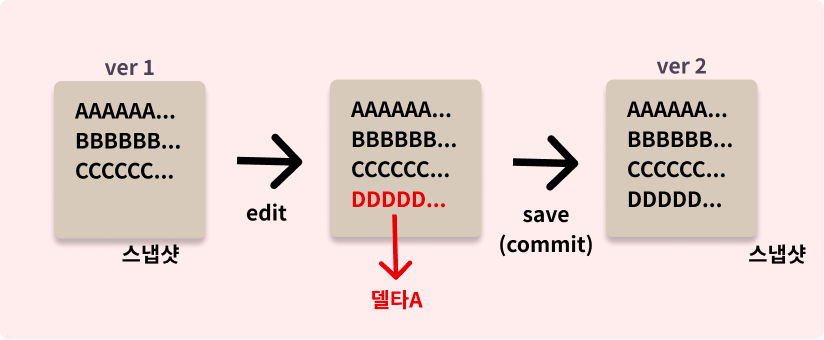
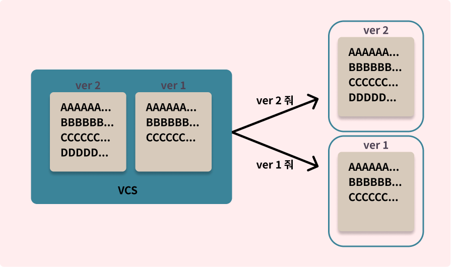
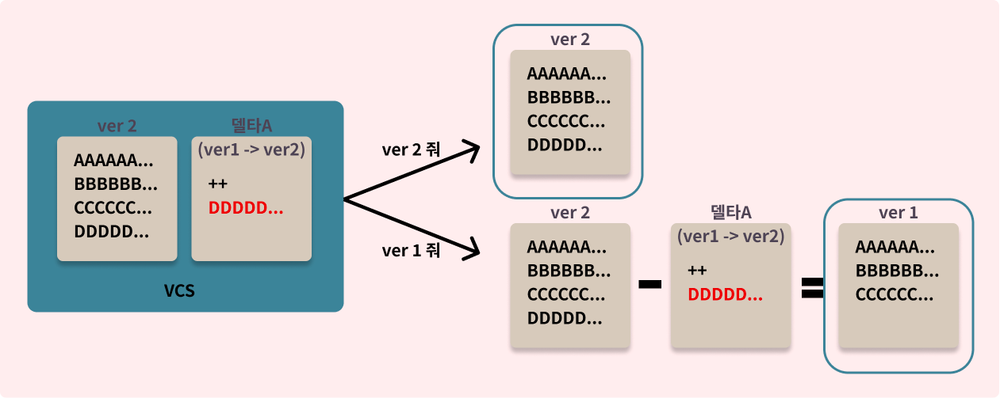

### 스냅샷과 델타

형상 및 버전을 관리하는 방식에는 **스냅샷**과 **델타**가 있습니다. VCS들의 특징과 VCS 커맨드 내부 동작은 기본적으로 스냅샷과 델타를 어떻게 조합하고 이용하느냐로 이루어져 있기 때문에 한 번쯤 생각하고 정리한다면 VCS의 동작을 이해하는 데 도움이 될 거라고 생각합니다.
여러 파일들이 함께 있는 저장소 파일 시스템의 변경 관점과 하나의 파일에서 변경점을 기록하는 관점이 있겠지만 쉬운 이해를 위해 하나의 파일의 관점에서 이해해봅시다.

특정 문서의 ver 1과 ver 2를 버전 관리하고 싶다고 가정합니다. ver 1 (이미 커밋된)이라는 문서에 `DDDDD...` 라는 변경 사항이 발생했습니다. 이러한 변경점을 델타라고 합니다. 즉, `DDDDD...` 를 추가한다" 가 하나의 델타가 됩니다.

버전을 관리하는 시스템이 있고 사용자가 원할 때 원하는 버전을 꺼내주어야 한다고 가정해봅시다. VCS의 입장에서는 두 가지의 선택지가 있을 것입니다.

첫 번째는 ver 1의 파일과 ver 2의 파일(스냅샷)을 각각 가지고 있다가 필요한 시점에 꺼내주는 것입니다. 각각의 스냅샷을 가지고 있어야 되기 때문에 저장 비용이 증가하겠지만 연산 없이 아주 빠르게 돌려줄 수 있을 것입니다.

두 번째는 특정 스냅샷과 (ver 2) 그 스냅샷에 링크되어있는 델타를 가지고 있는 것입니다. ver 2를 원하면 ver 2를 꺼내주면 되고 ver 1을 원하면 ver 2에서 델타를 빼서 ver 1을 만들어 돌려줍니다. 전체 파일을 가지고 있을 필요가 없고 변경점을 확인하기 쉽겠지만 다른 버전의 스냅샷을 생성하기 위해선 별도의 연산이 필요합니다.

### 1 + 1 = 2

우리는 `1 + 1 = ?` 에서 ?가 2 라는 사실과 `1 + ? = 2` 에서 ? 가 1 이란 걸 알 수 있습니다. VCS도 마찬가지입니다. 스냅샷 끼리의 변화를 계산하여 diff(델타)를 알 수도 있고, 스냅샷과 델타를 알면 새로운 스냅샷을 만들 수도 있습니다.

파일 하나가 아니라 VCS의 저장소의 입장에서 생각해봅시다. 여기서 git과 다른 델타 기반 VCS의 차이가 생깁니다.

델타 기반 VCS는 파일의 변화 기반으로 변경 목록을 만듭니다. 즉 각 버전(커밋)은 변경된 델타들만 가지고 있습니다. 특정 버전이 필요하다면 해당 버전에 맞는 각 파일들의 델타를 연산하여 버전을 만듭니다. (델타 체인)

git의경우 버전은 각 상태에 대한 스냅샷(모든 버전의 파일)을 가지고 있습니다. 즉 파일에 변경이 발생하면 새로운 Blob Object를 기록합니다. 변경되지 않은 파일은 해당 파일의 링크를 저장합니다. 따라서 특정 버전이 필요할 때 매우 빠르게 되돌려줄 수 있습니다.

즉, 100kb 파일에 한글자가 추가되어 저장하게 되면 데이터 베이스에 한글자가 추가된 약 100kb의 Blob 파일을 새로 저장합니다.

그럼 커밋을 할 때마다 변경된 파일에 대해 용량이 기하급수적으로 증가하지 않을까 하는 의문이 들 수 있습니다. Git은 기본적으로 스냅샷으로 히스토리 데이터를 다루지만 적절한 시점(ex. Loose객체가 너무 많을때, push 할때, git gc)에 압축 및 델타화를 하여 최적화 합니다.

### 커밋을 델타라고 생각하자

깃은 스냅샷이 기본이지만, 모순적으로 사용자로서 커밋은 단지 하나의 델타 라고만 이해하는 게 대부분의 경우 직관적입니다. 커밋들을 스냅샷들의 연속이라고 생각하면 rebase하여 커밋의 순서를 바꾸거나 특정 커밋을 빼거나, 체리픽 하는 등의 동작들을 이해하기 쉽지 않습니다.
하지만 커밋 하나하나가 변경 사항들만(델타) 가지고 있고 현재의 상태(혹은 특정 시점의 스냅샷)는 델타들의 링크드 리스트의 엔드 라고 생각하면 제법 이해해볼 법 합니다. 또한 커밋의 단위를 어떻게 해야 유연한 버전 관리가 가능할지에 대한 해답을 줍니다.

