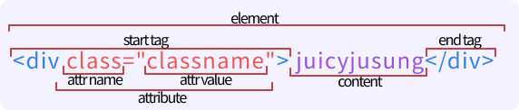
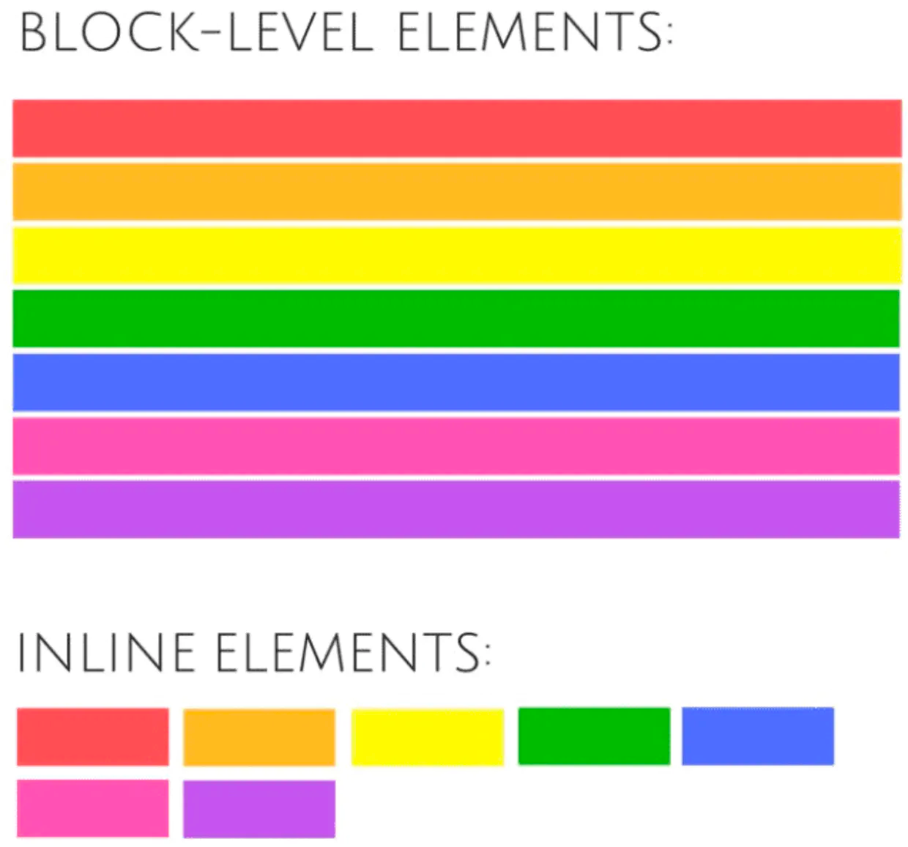

# Quest 01. HTML과 웹의 기초

## Introduction
* HTML은 HyperText Markup Language의 약자로, 웹 브라우저에 내용을 표시하기 위한 가장 기본적인 언어입니다. 이번 퀘스트를 통해 HTML에 관한 기초적인 사항들을 알아볼 예정입니다.

## Topics
* HTML의 역사
  * HTML 4.01, XHTML 1.0, XHTML 1.1
  * XHTML 2.0과 HTML5의 대립
  * HTML5와 현재
* 브라우저의 역사
  * Mosaic와 Netscape
  * Internet Explorer의 독점시대
  * Firefox와 Chrome의 등장
  * iOS Safari와 모바일 환경의 브라우저
  * Edge와 Whale 등의 최근의 Chromium 계열 브라우저
* HTML 문서의 구조
  * `<html>`, `<head>`와 `<body>` 등의 HTML 문서의 기본 구조
  * 시맨틱 엘리먼트
  * 블록 엘리먼트와 인라인 엘리먼트의 차이

## Resources
* [MDN - HTML](https://developer.mozilla.org/ko/docs/Web/HTML)
* [HTML For Beginners](https://html.com/)
* [History of the web browser](https://en.wikipedia.org/wiki/History_of_the_web_browser)
* [History of HTML](https://en.wikipedia.org/wiki/HTML)
* [StatCounter](https://gs.statcounter.com/)

## Checklist
### HTML 표준의 역사는 어떻게 될까요?
#### HTML 표준의 역사
  * **시작** - 팀 버너스리가  CERN(유럽 인자 물리 연구소)에서 문서를 이용하고 공유하기 위한 체계 인콰이어 (HTML의 원형)를 제안, 1989년 인터넷 기반 하이퍼텍스트 체계를 제안하는 메모를 작성 하였고  1991년 버너리스가 인터넷에서 문서를 "HTML 태그"로 부르면서 시작됨 HTML 1.0이 표준으로 등장, IETF(Internet Engineering Task Force)에서 관리 (1993년)
  * **HTML 2.0** - IETF는 HTML 작업그룹을 설립해 1.0의 모든기능과 몇가지 추가 기능을 포함하여 HTML 2.0 퍼블리싱 (1995년)
  * **HTML 3.2** - HTML사용자가 점점 증가하자 웹의 표준을 정의하는 국제 커소시엄 W3C가 표준을 정의(1996년)
  * **HTML 4** - 지속적인 발전, 안정된 표준버전 HTML 4.01 등장
  * **XHTML 1.0** - W3C의 새로운 표준으로 XML과 HTML을 합성하고 조금 더 엄격한 XHTML을 정의하였고, HTML은 발전 시키지 않을거라 공표 
  * **WHATWG** - XHTML이 하휘 호환성을 지원하지 않고 문법이 엄격하여 습득에 어려움을 느꼈고 브라우저 시장도 혼란해지고 W3C의 보수적인 표준화 방식에 답답함을 느꼈던 당시 대중적인 브라우저를 가지고 있던 기업들이 손을 맞잡았고 HTML을 계승하기 시작(2004년)
  * **W3C의 참여 와 HTML 5** - W3C는 결국 HTML5에 참여하겠다고 표명 하였고 HTML5 개발에 대해 WHATWG와 협력할 수 있는 워킹 그룹 결성. WHATWG의 스펙을 기반으로 한 HTML5 명세 (2006~2007)
  * **갈라섬** - 2011,2012년 서로 목표가 다르다는 점을 밝히면서 편집팀을 분리 하였고 W3C와 WHATWG는 2019년 까지 각자의 명세를 발표
  * **대통합** - 결국 2019년 W3C는 WHATWG의 "Living standard" 를 표준으로서 공동으로 작업하기로 합의

#### HTML 표준을 지키는 것은 왜 중요할까요?
  * 운영체제, 브라우저 등 어느 한쪽으로 최적화되거나 종속되지 않도록 할 수 있기 때문입니다. 
    
#### XHTML 2.0은 왜 세상에 나오지 못하게 되었을까요?
  * 웹 표준화 기구인 W3C(World Wide Web Consortium)에서는 HTML5에 대한 계획을 가지고 있지 않았습니다. 그 대신 XHTML1.0을 XML 기반으로 구체화하기 위한 작업에 몰두하고 있었습니다. 그러나 XHTML2.0은 견고한 웹을 구현한다는 취지아래 기존 웹과의 하위 호환성을 고려하지 않는 치명적인 문제를 안고 있었습니다.
  * W3C의 이러한 행보에 반기를 들고 HTML 및 관련 기술들을 발전시키는 데 관심이 있는 사람들의 모임인 WHATWG(Web Hypertext Application Technology Working Group)가 탄생했습니다. WHATWG는 2004년 애플, 모질라 재단, 오페라 소프트웨어가 공동으로 설립한 공개 그룹으로, 이 공개 그룹을 통해 Web Application1.0과 Web Forms2.0을 만들어 냈습니다.
  * WHATWG의 활동이 성과를 거두기 시작하고, 2007년 3월 W3C가 공개적으로 XHTML 2.0의 실패를 인정한 후 새롭게 HTML을 개발하기로 결정하면서 WHATWG의 표준안을 대부분 수용하여 HTML5가 탄생하였습니다.

#### HTML5 표준은 어떤 과정을 통해 정해질까요?
  1. Working Draft (WD) : 초안
     W3C가 그 멤버 뿐만 아니라 대중, 다른 기술단체 등 여러 커뮤니티에 검토를 받기 위해 공개한 문서입니다.
  2. Candidate Recommendation (CR) : 후보권고안
  광범위하게 검토를 받았고 워킹그룹의 기술적인 요구사항을 만족했다고 믿는 문서로서, W3C는 더 많은 구현 경험을 얻기 위해 이 문서를 공개합니다.
  3. Proposed Recommendation (PR) : 제안권고안
  광범위한 기술적인 구현과 검토가 끝난 거의 완성된 문서로서, 최종 승인을 얻기 위해 자문위원회에 보냅니다.
  4. W3C Recommendation(REC) : 권고안
  모든 합의를 끝낸 후 W3C멤버들과 감독에게 승인을 받은 문서로서, W3C는 이 문서가 널리 쓰이기를 권장합니다. W3C Recommendation는 다른 기관이 공개한 표준과 비슷합니다.
     
---
### 브라우저의 역사는 어떻게 될까요?
#### 브라우저의 역사
  * 1990 – **WorldWideWeb** (World Wide Web가 아닙니다) 팀 버너스리가 만든 최초의 브라우저 입니다. World Wide Web과 구별하기 위해 Nexus로 이름을 변경했습니다.
  * 1992 – **Lynx**는 텍스트 기반의 브라우저 입니다. 캔자스 대학교 캠퍼스 정보 서버"의 일부로 학내 정보를 배포하기 위한 목적으로 만든 하이퍼텍스트 탐색기가 그 시초입니다.
  * 1993 – **Mosaic**는 이미지를 표시할 수 있는 최초의 그래픽 웹 브라우저였습니다. 1990년대 최고 인기 프로그램 이라는 타이틀도 가지고 있습니다. Mosaic의 개발 책임자 였던 마크 앤드리슨은 동료들과 함께 나와 1994년 Netscape Navigator를 개발하며 사실상 개발이 중단 되었고 스파이글래스사를 거쳐 마이크로소프트에게 라이선스되어 인터넷 익스플로러까지 흘러갑니다.
  * 1994 – **Netscape Navigator** 모자이크를 개발했던 마크 앤드리슨과 동료들이 넷스케이프 회사에서 개발한 웹 브라우저 입니다. 한때 폭발적인 반응과 함께 약 90%의 점유율을 차지했었습니다.
  * 1995 – **Internet Explorer** 마이크로 소프트의 첫 브라우저 입니다. 시작은 스파이글래스 모자이크의 수정판 이었습니다. 1999년 이후로는 세계에서 가장 널리 쓰이는 웹 브라우저가 되었고 2001 ~ 2004년 에는 점유율이 95%에 육박하기도 하였습니다.
  * 1996 – **Opera** 1994년 노르웨이 최대 통신회사인 텔레너가 개발을 시작해 1996년 처음으로 공식 공개한 브라우저 입니다.
  * 2003 – **Safari** 애플이 맥킨토시를 위한 브라우저를 출시 하였습니다.
  * 2004 – **Firefox**  1차 브라우저 전쟁에서 패배한 넷스케이프 네비게이터는 소스코드를 공개하고 비영리 재단인 모질라 재단에 의해 계승되며 탄생하였습니다.
  * 2007 – **Mobile Safari** iOS 용 모바일 사파리가 출시되었습니다.
  * 2008 – **Google Chrome** 구글이 크롬을 출시하였습니다.
  * 2015 – **Microsoft Edge** IE11 트라이던트 엔진을 포크하여 개발하던 EdgeHTML 버전과 이후 새롭게 개발한 크로뮴 버전으로 나뉩니다.

#### Internet Explorer가 브라우저 시장을 독점하면서 어떤 문제가 일어났고, 이 문제는 어떻게 해결되었을까요?
* 보안에 약하고 웹 표준 언어 HTML5와의 낮은 호환성, 비표준 기술 사용(ex: ActiveX 등) 등 문제가 많았지만 독점하고 있었기 때문에 표준 스펙의 기술 발전을 더디게 하고 많은 사이트들이 IE만 지원하기도 하였습니다.
* 파이어폭스, 사파리, 특히 크롬 출시 이후 점유율이 타 브라우저에게 밀려 자연스럽게 주도권을 내주게 되었고, MS도 2022년 6월15일자로 컴퓨터 운영체제인 윈도10의 모든 버전에서 익스플로러에 대한 지원 중단을 선언하며 사실상 산소호흡기를 떼게 되었습니다.

#### 현재 시점에 브라우저별 점유율은 어떻게 될까요? 이 브라우저별 점유율을 알아보는 것은 왜 중요할까요?
* Desktop (Worldwide)
  * Chrome - 68.31%
  * Safari - 9.77%
  * Edge - 8.03%
  * Firefox - 7.36%
  * Opera - 2.61%
  * IE - 1.48%
* Mobile (Worldwide)
  * Chrome - 63.03%
  * Safari - 23.94%
  * Samsung Internet - 5.86%
  * UC Browser - 2.36%
  * Opera - 2.17%
  * Android - 1.03%
* 브라우저의 점유율과 동향을 파악 함은 지원이나 작업의 의사 결정에 도움을 줍니다.

#### 브라우저 엔진(렌더링 엔진)이란 무엇일까요? 어떤 브라우저들이 어떤 엔진을 쓸까요?
* HTML 페이지를 유저가 보는 웹페이지로 바꾸어 렌더링 해주는 즉, 요청한 콘텐츠를 표시해주는 기본 소프트웨어를 말합니다.
* 브라우저 엔진
  * 게코(Gecko) - 파이어폭스, 선더버드, 시몽키
  * 블링크(Blink) - 크롬, 오페라
  * 웹킷(Webkit) - 사파리
  * 트라이던트(Trident) - IE
  * EdgeHTML(트라이던트에서 파생) - 엣지 스파르탄(~2019)

#### 모바일 시대 이후, 최근에 출시된 브라우저들은 어떤 특징을 가지고 있을까요?
  * 같은 사용자가 여러 디바이스에서 접근하는 경우가 많아졌기 때문에 기기간 연동, 개인정보보호에 힘씀
  * 모바일 퍼스트 시대에 발맞춰 모바일 환경에 대한 도구 제공

---
### HTML 문서는 어떤 구조로 이루어져 있나요?
#### HTML 기본구조
```html
<!DOCTYPE html>
<html>
  <head>
    <meta charset="UTF-8">
    <title>title</title>
  </head>
  <body>
    body
  </body>
</html>
```

#### Element 기본 구조


#### `<head>`에 자주 들어가는 엘리먼트들은 어떤 것이 있고, 어떤 역할을 할까요?
`<head>` 엘리먼트는 HTML 문서의 메타데이터 컨테이너로 사용 됩니다. title, character set, styles, scripts 등이 메타데이터가 됩니다.
- `<title>`
  - 문서의 타이틀(HTML문서 전체의 타이틀)을 정의
- `<meta>`
  - 문서의 character 인코딩 특정
  - author, description, viewport등
  - og([Open Graph Data](https://ogp.me))
- `<link>`
  - 스타일시트, 파비콘 연결등 현재 문서와 외부 리소스의 관계를 명시
#### 시맨틱 태그는 무엇일까요?
시맨틱 태그란 코드만으로 브라우저, 검색엔진, 개발자 모두 컨텐츠의 의미를 이해할 수 있도록 역할을 하는 의미를 갖는 태그 입니다.  
  * 시맨틱 엘리먼트를 사용하면 어떤 점이 좋을까요?
    - 메타데이터와 자연어가 섞여있는 문서에서 검색엔진이 명확한 시멘틱 요소를 해석하게 되어 인덱싱을 돕는다
    - 개발자 역시 코드상에서 시맨틱 엘리먼트를 보면 요소의 의도와 의미를 명확하게 알 수 있다.
#### `<section>`과 `<div>`, `<header>`, `<footer>`, `<article>` 엘리먼트의 차이점은 무엇인가요?

- `<article>` vs `<section>` vs `<div>`
  - `<article>`: 컨텐츠가 그 자체만으로 완성된 내용일때. 즉, 포함하고 있는 컨텐츠가 따로 배포 되어도 재사용이 가능한 묶음
  - `<section>`: 서로 관계 있는 문서를 분리하는 역할
  - `<div>`: 아무 의미를 갖지 않는 컨테이너
  - 세가지 태그 모두 컨텐츠를 묶기위한 컨테이너 즉, 구획을 짓기 위한 요소로 사용됩니다. 일반적으로 컨텐츠가 독립적이고 하나의 완성된 문서(ex: 매거진, 뉴스기사, 블로그 포스트)일 경우 `<article>`, 그렇지 않고 컨텐츠가 주제와 관련된것이라면 `<section>`, 만약 아무런 의미적인 관련성이 없다면 `<div>` 를 사용
- `<header>`: 문서나 특정 구역의 header를 정의합니다.
  - 보통 제목요소, 로고, 아이콘, 저자 정보 등이 포함됩니다.
- `<footer>`: 문서나 특정 구역의 footer를 정의합니다.
  - 보통 저자정보, 저작권정보, 연락처, 사이트맵, 연관페이지 등이 포함됩니다.
   
#### 블록 레벨 엘리먼트와 인라인 엘리먼트는 어떤 차이가 있을까요?


  - 블록 레벨 엘리먼트
    - 부모 엘리먼트의 width를 가득 채운 한줄
    - 따라서 다음 엘리먼트는 줄바꿈이 이루어짐
    - 일반적으로 인라인 엘리먼트와 다른 블록 레벨 엘리먼트를 포함할 수 있음
    - 자식 엘리먼트들의 height 합이 부모 엘리먼트의 height
  - 인라인 엘리먼트
    - 컨텐츠의 크기만큼 넓이를 차지
    - 따라서 width, height의 변형 불가
    - 문서 흐름에서 줄바꿈을 강제하지 않음

## Quest
* [이 화면](screen.png)의 정보를 HTML 문서로 표현해 보세요. 다만 CSS를 전혀 사용하지 않고, 문서의 구조가 어떻게 되어 있는지를 파악하여 구현해 보세요.
  * [CSS Naked Day](https://css-naked-day.github.io/)는 매년 4월 9일에 CSS 없는 웹 페이지를 공개하여 내용과 마크업에 집중한 HTML 구조의 중요성을 강조하는 행사입니다.
* 폴더에 있는 `skeleton.html` 파일을 바탕으로 작업해 보시면 됩니다.
  * 화면을 구성하는 큰 요소들을 어떻게 처리하면 좋을까요?
  * HTML 문서상에서 같은 층위에 비슷한 요소들이 반복될 때는 어떤 식으로 처리하는 것이 좋을까요?

## Advanced
### XML은 어떤 표준일까요? 어떤 식으로 발전해 왔을까요?
   - XML( eXtensible Markup Language)은 W3C에서 개발된 다목적 마크업 언어 입니다. SGML(Standard Generalized Markup Language)이 미국정부, 정부와 관련된 기업들 및 출판사들에 의해 널리 사용되었으나 대중적으로 알려지지는 못했고 비용이 많이 들었습니다. 그래서 웹상에서 사용하기 위한 SGML을 계승한 비교적 간단한 HTML이 탄생 하였습니다. 하지만 HTML은 태그의 종류도 한정적이고 다양한 기능을 제공하지 못했기 떄문에 SGML의 융통성과 HTML의 대중성을 혼합하기 위해 W3C에 의해 개발 되었습니다.
    HTML에서 사용되는 태그는 정해져있지만, XML에서는 Element를 사용자가 자유롭게 지정할 수 있습니다. 즉, 문서의 논리적 구조를 표현하기 위해 작성자가 내용에 의미를 부여할 수 있습니다.
     
### YML, Markdown 등 다른 마크업 언어들은 어떤 특징을 가지고 있고, 어떤 용도로 쓰일까요?
#### YAML
```yaml
person:
  name: John Grib
  age: 35
  hobby:
    - book
    - sports
```
- YAML의 계층 구조(부모-자식)은 들여쓰기(스페이스)로 구분함
- 보통 설정 파일에 많이 쓰임
- 앵커와 별칭 및 상속도 지원
#### Markdown
```markdown
# Heading1
===
## Heading2

1. list1
2. list2
    - abc
    - def

- 순서가 필요하지 않은 목록에 사용 가능한 기호
    - 대쉬(hyphen)
    * 별표(asterisks)
    + 더하기(plus sign)

두껍게: __언더바(underscore)__ or **별표(asterisks)**
이테릭체: _언더바(underscore)_ or *별표(asterisks)*
링크: [GOOGLE 링크](https://google.com)
이미지: 

```
- 서식이 있는 문서를 작성하는데 사용
- 문법이 쉽고 간단
- 읽기 쉽고 쓰기 쉬운 플레인 텍스트 포맷
- 구조적으로 유효한 HTML로의 변환이 가능하게 하는것이 목표
