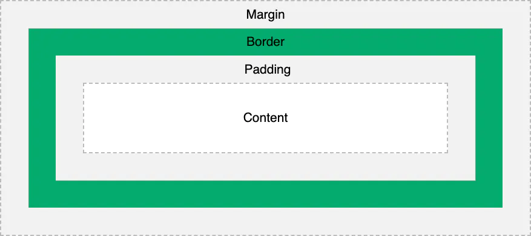
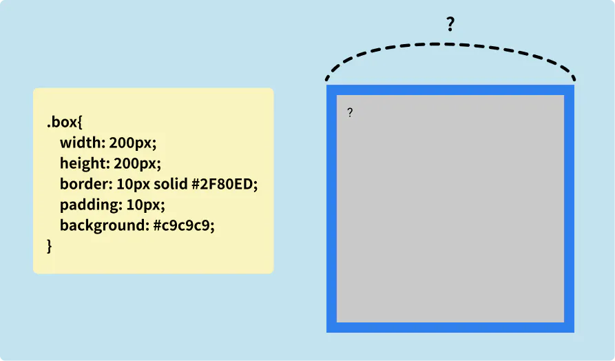
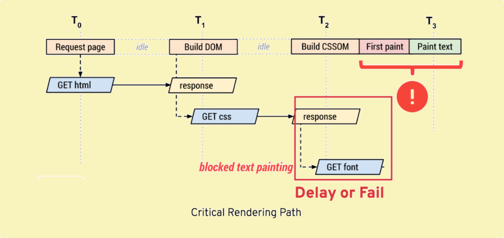

# Quest 02. CSS의 기초와 응용

## Introduction
* CSS는 Cascading StyleSheet의 약자입니다. 웹브라우저에 표시되는 HTML 문서의 스타일을 지정하는 (거의) 유일하지만 다루기 쉽지 않은 언어입니다. 이번 퀘스트를 통해 CSS의 기초적인 레이아웃 작성법을 알아볼 예정입니다.

## Topics
* CSS의 기초 문법과 적용 방법
  * Inline, `<style>`, `<link rel="stylesheet" href="...">`
* CSS 규칙의 우선순위
* 박스 모델과 레이아웃 요소
  * 박스 모델: `width`, `height`, `margin`, `padding`, `border`, `box-sizing`
  * `position`, `left`, `top`, `display`
  * CSS Flexbox와 Grid
* CSS 표준의 역사
* 브라우저별 Developer tools

## Resources
* [MDN - CSS](https://developer.mozilla.org/ko/docs/Web/CSS)
* [Centering in CSS: A Complete Guide](https://css-tricks.com/centering-css-complete-guide/)
* [A complete guide to Flexbox](https://css-tricks.com/snippets/css/a-guide-to-flexbox/)
* [그리드 레이아웃과 다른 레이아웃 방법과의 관계](https://developer.mozilla.org/ko/docs/Web/CSS/CSS_Grid_Layout/%EA%B7%B8%EB%A6%AC%EB%93%9C_%EB%A0%88%EC%9D%B4%EC%95%84%EC%9B%83%EA%B3%BC_%EB%8B%A4%EB%A5%B8_%EB%A0%88%EC%9D%B4%EC%95%84%EC%9B%83_%EB%B0%A9%EB%B2%95%EA%B3%BC%EC%9D%98_%EA%B4%80%EA%B3%84)

## Checklist

---

### CSS를 HTML에 적용하는 세 가지 방법은 무엇일까요?

#### 인라인 스타일

```html
<p style="color:red; background-color:yellow;">foo</p>
```

HTML의 스타일 속성으로 css코드를 삽입합니다.

#### 내부 스타일시트

```html
<p class="content">foo</p>
...
<style>
.content {
	color: red;
}
</style>

```

HTML문서 안에 스타일 코드를 작성합니다.

#### 외부 스타일시트

```css
/* style.css */
.content {
	color: red;
}
```

```html
<link rel="stylesheet" type="text/css" href="style.css">
or
<style type="text/css">
	@import url("mystyle.css");
</stlye>
```

외부에 css파일을 작성하고 HTML문서에서 불러옵니다.

### 세 가지 방법 각각의 장단점은 무엇일까요?

- **인라인 스타일**
  - 간단한 스타일의 경우 직관적일 수 있으나, 스타일 코드가 복잡하면 가독성이 떨어지고 재사용이 불가능 합니다. 또한 인라인 스타일은 높은 우선순위를 갖기 때문에 일관된 스타일 적용을 방해할 수 있습니다.
- **내부 스타일시트**
  - 하나의 HTML문서에서 여러 요소들에 스타일을 적용할 수 있으나, 다른 문서에서 적용할 수 없습니다.
- **외부 스타일시트**
  - 하나의 스타일시트를 여러 문서에서 재사용 할 수 있습니다. 디팬던시가 생기고 복잡해지면 추적이 어려울 수 있습니다.

---

### CSS 규칙의 우선순위는 어떻게 결정될까요?

#### 기본룰

- 범위가 작을수록 (구체적이고 한정적 일수록) 우선순위가 높다.
- 같은 우선순위라면 뒤에 오는 규칙이 우선순위가 높다.
- !important를 우선한다.

#### 스타일시트 우선순위

- **user style sheets**: 브라우저에서 폰트 사이즈를 키운다거나, 플러그인을 이용한다거나등 브라우저에서 사용자가 설정하는 스타일시트
- **author style sheets**: 개발자가 작성한 스타일시트
- **user agent style sheets**: 브라우저의 디폴트 스타일시트

1. user important declarations (!important)
2. author important declarations (!important)
3. author normal declarations
4. user normal declarations
5. user agent

#### 선택자 우선순위

1. 속성 값 뒤에 `!important` 를 붙인 속성
2. 인라인 스타일
3. `#id` 아이디 선택자
4. 클래스/속성/가상 선택자
5. 태그 엘리먼트 선택자

---

### CSS의 박스모델은 무엇일까요? 박스가 화면에서 차지하는 크기는 어떻게 결정될까요?



브라우저의 렌더링 엔진은 표준 CSS 기본 박스 모델에 따라 각각의 요소를 사각형 박스로 표현

- content : 요소의 콘텐츠가 표시되는 영역
- padding : content 영역과 border 사이의 안쪽 여백
- border : padding 영역과 margin 사이의 테두리
- margin : border를 기준으로 다른 요소와의 바깥쪽 여백



#### border-sizing 엘리먼트의 크기의 기준

- `border-sizing: content-box` : 컨텐츠 영역이 크기의 기준(width, height 값의 기준)
- `border-sizing: border-box` : border 영역 까지가 크기의 기준(width, height 값의 기준)

예를들어 `width: 100px; height 100px; padding: 20px;` 의 엘리먼트가 있을때
`border-sizing: content-box` 로 설정하면 content 100,100 padding 20,20 총 140,140의 영역을 크기로 계산
`border-sizing: border-box` 로 설정하면 content 60,60 padding 20, 20 총 100,100의 영역을 크기로 계산

---

### `float` 속성은 왜 좋지 않을까요?

- 레이아웃 정렬을 위해 설계된 속성이 아님에도 과거 레이아웃 정렬을 위해 사용 되었음
- 레이아웃을 위해 flexbox나 grid 같은 대안이 있음
- 부모 요소가 자식 요소의 크기를 인식할수 없어 다른 요소의 레이아웃 배치에 영향을 줌
- 이슈를 해결하긴 위한 솔루션(overflow, clear등)들이 직관적이지 않고 디버깅과 유지보수를 힘들게함

---

### Flexbox(Flexible box)와 CSS Grid의 차이와 장단점은 무엇일까요?

#### flex

- 1차원 레이아웃 시스템
- 컨텐츠의 흐름에 초점
- 컨텐츠 정렬, 1차원에서 컨텐츠를 균등하게 배치하는 경우

#### grid

- 2차원 레이아웃 시스템
- 컨텐츠의 배치(레이아웃)에 초점
- 요소간 간격 조절, 최소 너비에 맞게 칼럼들의 사이즈가 변경되는 경우, 복잡한 2차원 레이아웃, 반응형 레이아웃

---

### CSS의 비슷한 요소들을 어떤 식으로 정리할 수 있을까요?

- OOCSS(Object Oriented CSS)
  - 구조와 외형의 분리
  - 컨테이너와 내용 분리
- BEM(Block Element Modifier)
  - Block, Element, Modifier로 나누어 클래스 이름을 기술
- SMACSS (Scalable and Modular Architecture for CSS)
  - CSS를 모듈화하고 확장 가능하게 만드는 것을 목표
  - 5개의 구분된 카테고리
    - Base : 기본 규칙
    - Layout : 레이아웃 규칙
    - Module : 모듈 규칙
    - State : 상태 규칙
    - Theme : 테마 규칙

---


## Quest
* Quest 01에서 만들었던 HTML을 바탕으로, [이 그림](./screen.png)의 레이아웃과 CSS를 최대한 비슷하게 흉내내 보세요. 꼭 완벽히 정확할 필요는 없으나 align 등의 속성은 일치해야 합니다.
* **주의사항: 되도록이면 원래 페이지의 CSS를 참고하지 말고 아무것도 없는 백지에서 시작해 보도록 노력해 보세요!**

## Advanced

---

### **왜 CSS는 어려울까요?**

- CSS는 여러곳에서 여러번 스타일 규칙이 선언될 수 있기 때문에 최종 적용되는 규칙을 예측하기 힘듭니다.
- 다양한 뷰포트에 지원해야하고 사람이 직접 geometry 계산을 하기 힘듭니다.
- 운영체제, 브라우저 종류, 버전 등에 따라 결과물이 다를 수 있습니다.
- 속성들이 많고 프로그래밍적인 문법이 많지 않습니다.
- 엘리먼트와의 코드상의 거리가 멀어 관리하기가 쉽지 않습니다.

---

### **CSS의 어려움을 극복하기 위해 어떤 방법들이 제시되고 나왔을까요?**

- sass, less 등 코드중복을 줄이고 조금 더 프로그래밍적인 문법을 지원하는 CSS Preprocessor
- css의 새로운 스펙 추가
- 스타일의 적용 scope, namespace를 명확하게 하고 위한 모듈화
- Styled componets와 같은 CSS-in-JS

---

### **CSS가 브라우저에 의해 해석되고 적용되기까지 내부적으로 어떤 과정을 거칠까요?**

- css파일 스타일시트 객체로 파싱
- 캐스캐이딩 (각 요소의 우선순위)
- 랜더트리 구축 with 리플로우(요소의 위치정보 계산)
- 그리기

---

### **웹 폰트의 경우에는 브라우저 엔진 별로 어떤 과정을 통해 렌더링 될까요?**



웹폰트는 로컬의 폰트 설치 환경에 상관없이 웹에서 원하는 타이포그래피를 사요알 수 있게 하는 기술 입니다. 웹폰트는 CSSOM을 생성하는 과정에서 폰트파일을 다운로드하기 시작합니다. 따라서 paint단계에서 아직 폰트의 다운로드가 완료되지 않는 경우가 발생합니다. 따라서 웹폰트가 적용되는 시점에서 번쩍임이 발생합니다.

- IE계열
  - FOUT(Flash of unstyled text)
  - 웹폰트가 로딩이 될때까지 fallback 폰트로 렌더링을 하고, 로딩이 완료되면 웹폰트로 전환
- 그외 브라우저
  - FOIT (Flash of invisible text)
  - 웹폰트가 로딩 되기 전까지 해당 텍스트를 랜더링 하지 않음, 로딩이 완료되면 웹폰트로 전환
