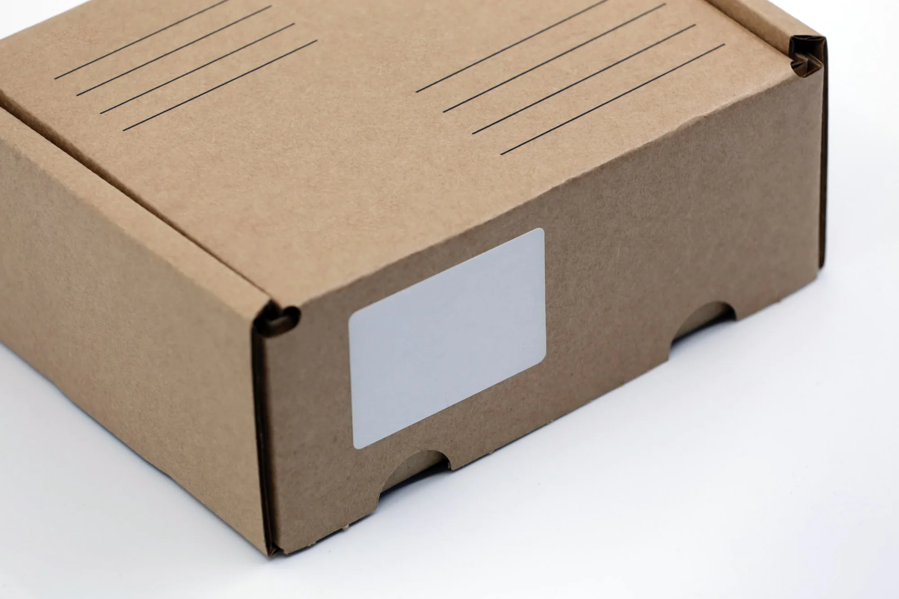
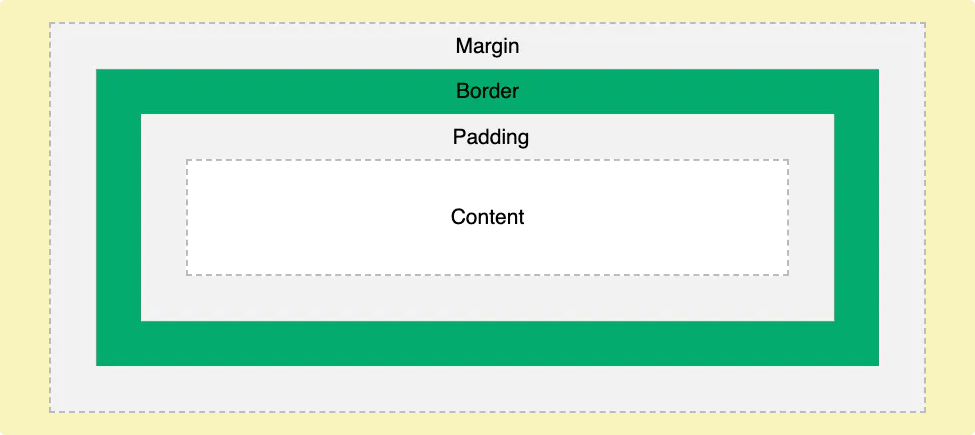

# [CSS 박스 모델](https://www.juicylog.com/cssboxmodel)

## 기본 박스 모델

브라우저 안에 원하는 위치에 원하는 크기의 요소들을 계산하고 배치 하기 위해서 **박스 모델**을 사용합니다. 박스모델은 CSS에서 디자인과 레이아웃을 말할 때 사용됩니다. CSS 상자 모델은 기본적으로 모든 HTML 요소를 감싸는 상자이며 margin, border, padding, content로 구성됩니다.

- content : 요소의 콘텐츠가 표시되는 영역
- padding : content 영역과 border 사이의 안쪽 여백
- border : padding 영역과 margin 사이의 테두리
- margin : border를 기준으로 다른 요소와의 바깥쪽 여백

## box-sizing

그럼 우리가 box level element에 적용하는 width, height와 같은 값은 어디까지의 크기를 의미 하는걸까요? 컨텐츠 영역만 의미하는 걸까요? 아니면 가장 바깥 쪽의 여백(margin) 까지 일까요?

기본적으로 박스 모델의 width와 height는 content 영역의 크기를 의미합니다. 또 재밌는것은 마지막에 보더를 점선으로한 예시를 보면 border가 padding 영역 바깥쪽에 그려지는게 아니라 마치 content영역이 border의 크기까지 확장된후 그 위에 border 그려지는 것을 확인할 수 있습니다.

아래와 같이 `width: 100px; height: 300px` 의 컨테이너 안에 `width: 100px; height: 100px` 박스 3개를 넣어보겠습니다.

box1은 우리가 의도한것처럼 부모인 컨테이너 안에 딱 맞게 들어갔습니다.

하지만 이전 codepen에서 예상할 수 있듯이 의도와는 다르게 컨테이너 영역을 벗어나게 됩니다.

즉, 기본적으로 엘리먼트의 크기를 정하는 width와 height는 content 영역이 기준이 되고 보장된다는걸 알 수있습니다.

그럼 만약 padding, border를 합친 크기가 `width: 100px; height: 100px;` 가 되려면 어떻게 해야할까요?

> box-sizing: content-box | border-box | initial | inherit
>
> **content-box** : 기본 CSS 박스 크기 결정법을 사용합니다. 요소의 너비를 100 픽셀로 설정하면 콘텐츠 영역이 100 픽셀 너비를 가지고, 테두리와 안쪽 여백은 이에 더해집니다.
>
> **border-box** : 테두리와 안쪽 여백의 크기도 요소의 크기로 고려합니다. 너비를 100 픽셀로 설정하고 테두리와 안쪽 여백을 추가하면, 콘텐츠 영역이 줄어들어 총 너비 100 픽셀을 유지합니다. 대부분의 경우 이 편이 크기를 조절할 때 쉽습니다.

위의 코드와 같이 `box-sizing: border-box;` 를 주면 border 까지의 크기를 기준이되는 박스의 크기로 다룹니다.

다시 돌아와 박스3개 넣기 예제에도 적용해보면 의도한것과 같이 올바른 크기의 박스를 생성할 수 있습니다.
