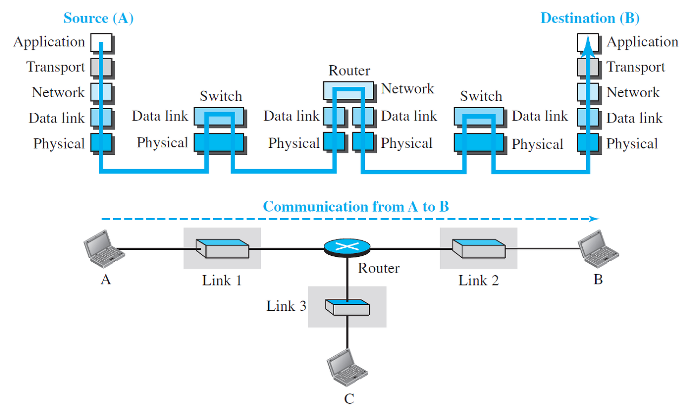
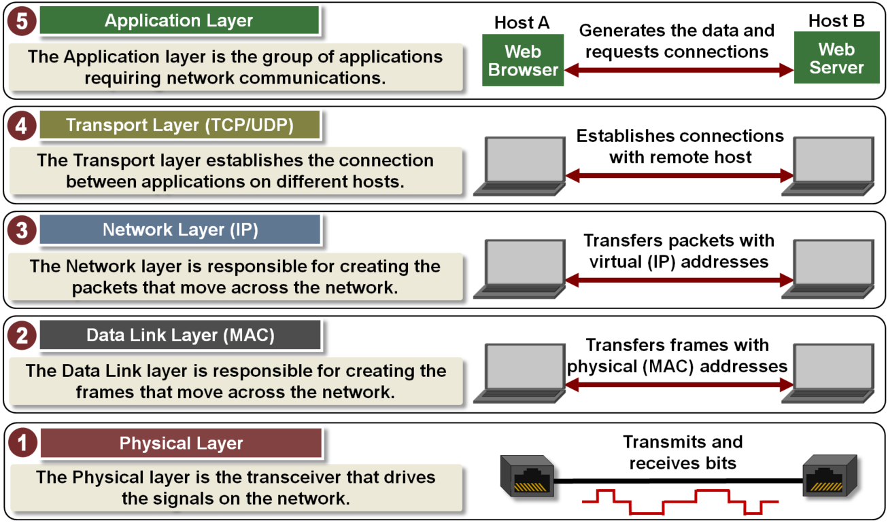
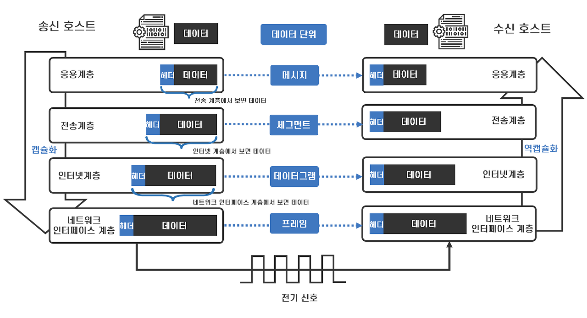
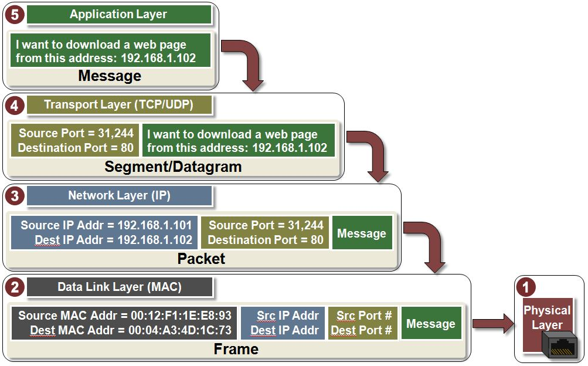
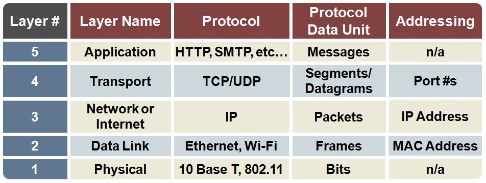
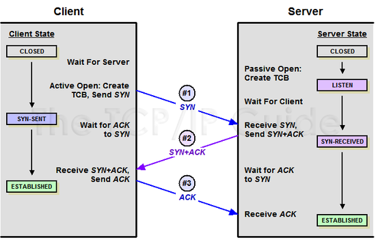
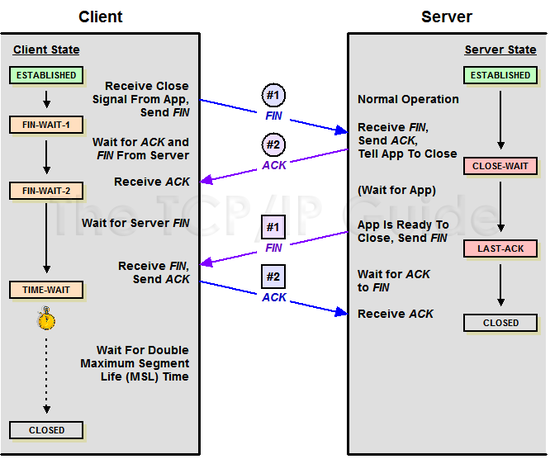
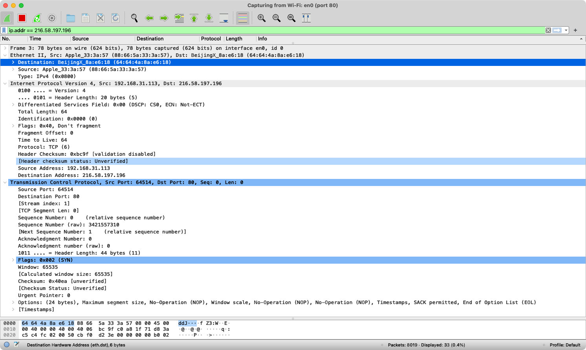

# Quest 06. 인터넷의 이해

## Introduction
* 이번 퀘스트에서는 인터넷이 어떻게 동작하며, 서버와 클라이언트, 웹 브라우저 등의 역할은 무엇인지 알아보겠습니다.

## Topics
* 서버와 클라이언트, 그리고 웹 브라우저
* 인터넷을 구성하는 여러 가지 프로토콜
  * IP
  * TCP
  * HTTP
* DNS

## Resources
* [OSI 모형](https://ko.wikipedia.org/wiki/OSI_%EB%AA%A8%ED%98%95)
* [IP](https://ko.wikipedia.org/wiki/%EC%9D%B8%ED%84%B0%EB%84%B7_%ED%94%84%EB%A1%9C%ED%86%A0%EC%BD%9C)
  * [Online service Traceroute](http://ping.eu/traceroute/)
* [TCP](https://ko.wikipedia.org/wiki/%EC%A0%84%EC%86%A1_%EC%A0%9C%EC%96%B4_%ED%94%84%EB%A1%9C%ED%86%A0%EC%BD%9C)
  * [Wireshark](https://www.wireshark.org/download.html)
* [HTTP](https://ko.wikipedia.org/wiki/HTTP)
  * Chrome developer tool, Network tab
* [DNS](https://ko.wikipedia.org/wiki/%EB%8F%84%EB%A9%94%EC%9D%B8_%EB%84%A4%EC%9E%84_%EC%8B%9C%EC%8A%A4%ED%85%9C)
  * [Web-based Dig](http://networking.ringofsaturn.com/Tools/dig.php)

## Checklist
### 인터넷은 어떻게 동작하나요? Internet Protocol Suite의 레이어 모델에 입각하여 설명해 보세요.

**Internet Protocol Suite**는 인터넷에서 컴퓨터들이 서로 정보를 주고받는 데 쓰이는 통신규약(프로토콜)의 모음입니다. 인터넷 프로토콜 스위트 중 TCP와 IP가 가장 많이 쓰이기 때문에 TCP/IP 프로토콜 스위트고도 불립니다.

인터넷이란 전세계에 걸쳐 데이터를 주고 받을 수 있는 네트워크 시스템 입니다. 데이터를 주고 받기 위하여 어떤 종류의, 어떤 데이터를, 어떤 방식으로, 어떻게, 어디로 주고 받을지를 판단할 수 있게 패키징 하여야 합니다. 데이터를 정확하게 전송하기 위해 데이터를 쪼개고 포장하고 정보를 적는등의 동작을 프로토콜 이라는 규약에 맞게 각 계층(layer)에서 담당을 하게 됩니다.



호스트 간에 TCP/IP에 기반한 데이터 통신을 할 때는 TCP/IP를 구성하는 각 계층이 아래 위로 인접한 계층과 데이터를 주고받으며 통신을 처리합니다.

TCP/IP 계층은 기본적으로는 4계층이나 최근에는 물리계층을 분리하여 5계층으로 설명합니다. (따라서 OSI 계층과 레이어명 매칭이 좀더 자연스러워 졌습니다.)



- Application Layer
  - 이용자들이 직접 응용프로그램을 이용하여 소통하는 계층입니다. SMTP, FTP, SSH, HTTP 등과 같은 프로토콜이 작동하는 곳이 바로 어플리케이션 층입니다.
- Transport Layer
  - 라우터들에 의해 분리된 원격 네트워크의 호스트들 사이에서 데이터 전송을 신뢰성 있게 마무리 짓는 역할을 합니다. 이를 위해 TCP와 같은 커넥션 프로토콜이 존재하여 데이터 도착을 확인합니다. 도착 확인이 안되면 데이터를 다시 전송합니다.
- Network Layer
  - 네트워크 장벽을 넘어서 데이터를 교환하는 작업을 수행합니다. IP 프로토콜을 이용하여 데이터를 어디에(addressing)과 어떤경로를 통해(routing) 보내는가 하는 질문에 답해줍니다.
- Data Link Layer
  - 데이터 링크계층에서는 물리계층에서 수신되는 신호들을 해석하는 방법을 정의합니다.
- Physical Layer
  - 물리적인 연결과 전기 신호의 변환/제어를 담당합니다.





송신 호스트의 각 계층에서는 프로토콜을 처리하고 상위 계층에서 받은 데이터에 헤더(수신 호스트의 해당 계층에서 데이터를 처리할때 필요한 정보)를 붙여 하위 계층으로 넘깁니다. 즉, 각 계층에서 필요한 송신지나 수신지에 대한 정보 (물리정보, IP주소, 포트 번호 등)을 계층에따라 캡슐화 하여 전송하게 됩니다. 최하위 계층에서는 이 데이터를 전기 신호로 변환하여 전송 매체를 통해 라우터 등의 중간 노드를 거쳐 수신 호스트의 네트워크 계층으로 전송 됩니다.

수신 호스트는 이와 반대로 수신 받은 데이터에 포함된 헤더의 정보를 사용하여 해당 계층의 프로토콜을 처리한 후 헤더를 제거하여 상위 계층으로 넘깁니다(역캡슐화). 수신 호스트는 최종적으로 송신 호스트가 보낸 데이터를 받게됩니다.

---


---

### 근거리에서 서로 떨어진 두 전자기기가 유선/무선으로 서로 통신하는 프로토콜은 어떻게 동작할까요?

서로 떨어진 두 전자기기가 통신하기 위해서는 송신자는 디지털 데이터를 아날로그 전기 신호로 변환하여 케이블 혹은 전파로 전송하게됩니다. 즉, 비트 스트림을 송신자 수신자가 인식할 수 있는 예측 가능한 패턴(데이터 비트, 제어 비트 구별 및 오류 탐지)으로 인코딩하고 전기, 광학, 무선 신호를 생성합니다.

---

### 근거리에 있는 여러 대의 전자기기가 서로 통신하는 프로토콜은 어떻게 동작할까요?

여러대의 장치가 서로 통신하기 위해서 가장 좋은 방법은 모든 기기가 서로 연결이 되어 있으면 됩니다. 하지만 비용적으로, 물리적으로 구현하기 힘듭니다. 따라서 모든 기기는 L2 스위치(혹은 그 이상의 역할이 가능한 장치)에 연결되고  그 장치가 중계 역할을 하게 됩니다.

어떤 노드가 서로 통신하는건지, 개별 노드간 통신의 시작과 끝이 언제인지, 노드가 통신하는동안 발생한 오류는 무엇인지, 어떤 노드가 다음으로 통신하게 될건지의 정보가 포함되기위해 상위 계층의 데이터(패킷) 앞뒤에 헤더(Frame start, Addressing, Type, Quality Control)와 트레일러(Error detection, Frame stop)를 추가(프레이밍)하고 이렇게 캡슐화된 단위(PDU)를 프레임이라고 합니다.

- Flow control
  - 송신측이 수신측의 처리 속도보다 더 빠른 속도로 데이터를 보내 수신측의 버퍼가 가득차는 등, 데이터가 손실 될 수 있기 때문에 수신측에서 송신측에 그만 보내라거나 천천히 보내라는 피드백
- Error control
  - 전기 신호는 노이즈에 취약하기 때문에 송신측이 프레이밍 하여 전송한 전기신호를 수신 측의 L2 계층이 에러를 검출하고 직접 수정하거나 재전송을 요청

---

### 아주 멀리 떨어져 있는 두 전자기기가 유선/무선으로 서로 통신하는 프로토콜은 어떻게 동작할까요?

네트워크레이어 에서는 상위 계층의 PDU(Segments/Datagrams)에 IP헤더를 캡슐화 합니다. 이 헤더에는 목적지의 주소, 근원지의 주소, TTL, TOS, 프로토콜(TCP, UDP, ICMP등), Fragment offset 등의 정보가 포함됩니다. 이렇게 캡슐화 된 단위를 패킷이라고 합니다.

한 네트워크가 아닌 서로 다른 네트워크 간의 통신을 하기 위해서는 L3라우터가 필요합니다. 라우터는 라우팅 테이블을 기반으로 해당 목적지 까지 갈 수 있는 길을 검사하고 어떤 경로로 전송하는 것이 가장 효율적인지 결정하고  패킷의 정보를 이용하여 최종 목적지 까지 스위칭 하는 역할을 합니다 (라우팅).

---

### 두 전자기기가 신뢰성을 가지고 통신할 수 있도록 하기 위한 프로토콜은 어떻게 동작할까요?

대부분의 네트워크는 단일 PDU에 포함될 수 있는 데이터 양의 제한이 있습니다. 전송 계층에서는 데이터를 적절한 크기의 블록으로 나눕니다. 또한 반대로 어플리케이션 이나 서비스로 데이터를 전송하기 전에 데이터를 다시 조립합니다. 호스트에는 많은 어플리케이션 혹은 서비스가 실행되고 있을 수 있습니다. 전송계층이 이를 식별하기 위해 포트가 할당 됩니다. 또한 프로토콜 별로 아래와 같은 기능들을 하기도 합니다.

- 세션 설정
  - 전송 계층은 애플리케이션 간에 세션을 생성하여 이 연결 방향을 제공할 수 있습니다. 이러한 연결은 데이터가 전송되기 전에 애플리케이션이 서로 통신할 수 있도록 준비합니다.
- 신뢰할 수 있는 딜리버리
  - 여러 가지 이유로 인해 데이터가 네트워크를 통해 전송될 때 손상되거나 완전히 손실될 수 있습니다. 전송 계층은 손실된 데이터를 소스 디바이스가 재전송하도록 함으로써 모든 부품이 대상에 도달하도록 보장할 수 있습니다.
- 같은 순서의 딜리버리
  - 네트워크는 서로 다른 전송 시간을 가질 수 있는 여러 경로를 제공할 수 있으므로 데이터가 잘못된 순서로 도착할 수 있습니다. 세그먼트에 번호를 매기고 시퀀스를 지정함으로써 전송 계층은 세그먼트가 올바른 순서로 재조립되도록 할 수 있습니다.
- 흐름 제어
  - 네트워크 호스트에는 메모리 또는 대역폭과 같은 제한된 리소스가 있습니다. 전송 계층에서 이러한 리소스가 과중한 상태임을 인식하면 일부 프로토콜에서 전송 응용 프로그램에 데이터 흐름 속도를 줄이도록 요청할 수 있습니다. 이는 소스가 그룹으로 전송하는 데이터 양을 조절하여 전송 계층에서 수행됩니다. 흐름 제어는 네트워크에서 세그먼트 손실을 방지하고 재전송의 필요성을 피할 수 있습니다.

신뢰성을 위해 **전송된 데이터의 트래킹**, **수신된 데이터에 대한 확인**, **확인되지 않은(unacknowledged) 데이터의 재전송**의 기본동작을 합니다. 신뢰성을 위해서는 모든 데이터 조각을 추적하고 필요에 따라 재전송을 받아야하고 이는 추가적인 오버헤드를 가지게 됩니다. 따라서 신뢰성의 중요함과 네트워크 비용 및 퍼포먼스의 사이에서 절충이 이루어져야 합니다. 예를들어 데이터베이스, 웹 페이지와 같은 데이터는 전송된 모든 데이터가 완벽하게 원래 상태로 도착하여야 합니다. 데이터가 누락되거나 불완전하면 사용할 수 없습니다. 반대로 스트리밍 비디오나 이미지의 경우 모든 데이터가 완벽한것을 보장해야 한다면 굉장히 좋지 못한 퍼포먼스가 발생할 수 있습니다.

이런 역할을 하는 가장 일반적으로 프로토콜은 TCP와 UDP입니다.

UDP는 오버헤드가 낮은 무연결 프로토콜 입니다. DNS, 비디오스트리밍, VoIP등이 UDP를 사용합니다.

TCP는 연결 지향 프로토콜이며 신뢰성을 위해 추가적인 오버헤드를 발생시킵니다. Same order delivery, Reliable delivery, Flow control등의 기능을 갖게 됩니다.

연결을 생성하기 위해 **3-way handshake**, 종료하기 위해 **4-way handshake** 과정을 거칩니다





---

### HTTP는 어떻게 동작할까요?

- 기본흐름
  - 웹서버와 TCP 연결 시도 (3-way handshake) (HTTPS 요청이라면 TLS handshake)
  - 서버에게 해당 URL로 GET 요청
  - 서버가 클라이언트에게 데이터(웹문서) 응답
  - 연결 해제 (4-way handshake)
- 특징
  - Stateless
  - default port: 80
- HTTP 요청 메서드(HTTP verbs)
  - **GET** : 존재하는 자원에 대한 **요청**
  - **POST** : 새로운 자원을 **생성**
  - **PUT** : 존재하는 자원에 대한 **변경**
  - **DELETE** : 존재하는 자원에 대한 **삭제**
  - HEAD : 서버 헤더 정보를 획득. GET과 비슷하나 Response Body를 반환하지 않음
  - OPTIONS : 서버 옵션들을 확인하기 위한 요청.
- HTTP 상태 코드 (HTTP status code)
  - 2XX - 성공
  - 3XX - 리다이렉션
  - 4XX - 클라이언트 에러
  - 5XX - 서버에러

---

### 우리가 브라우저의 주소 창에 [www.knowre.com](http://www.knowre.com/) 을 쳤을 때, 어떤 과정을 통해 서버의 IP 주소를 알게 될까요?

- 주소창에 주소 입력
- 브라우저, 운영체제 캐쉬 조회
- 없다면 Local DNS에 요청
- 없다면 Local DNS는 다른 DNS 서버들에 요청 (Root DNS 까지)
- 찾으면 Local DNS는 해당 IP주소를 캐싱하고 IP주소를 응답

---
## Quest
### tracert(Windows가 아닌 경우 traceroute) 명령을 통해 [www.google.com](http://www.google.com/) 까지 가는 경로를 찾아 보세요.

```
traceroute to www.google.com (216.58.197.196), 64 hops max, 52 byte packets
 1  xiaoqiang (192.168.31.1)  2.603 ms  2.551 ms  1.527 ms
 2  * * *
 3  125.141.249.139 (125.141.249.139)  4.696 ms  4.811 ms  4.452 ms  // 서울, 성남(정자동)
 4  * * *
 5  * * *
 6  112.174.73.98 (112.174.73.98)  5.668 ms  // 서울? 성남?
    112.174.42.38 (112.174.42.38)  3.460 ms  // 서울?, 성남?, 나주?
    112.174.7.118 (112.174.7.118)  5.079 ms // 서울?, 성남?, 나주?
 7  72.14.194.194 (72.14.194.194)  34.915 ms  // 캘리포니아? 서산?
    74.125.52.16 (74.125.52.16)  40.482 ms  // 캘리포니아? 뉴욕?
    72.14.194.194 (72.14.194.194)  42.732 ms
 8  108.170.242.161 (108.170.242.161)  39.059 ms  // 도쿄? 캘리포니아? 퀘백?
    108.170.242.193 (108.170.242.193)  34.800 ms  // 도쿄? 캘리포니아? 퀘백?
    108.170.242.161 (108.170.242.161)  40.995 ms  // 도쿄? 캘리포니아? 퀘백?
 9  72.14.233.221 (72.14.233.221)  32.538 ms  35.340 ms  41.215 ms  // 캘리포니아? 조지아? 퀘백?
10  nrt13s48-in-f4.1e100.net (216.58.197.196)  35.268 ms  34.264 ms  32.780 ms //캘리포니아? 광동? 도쿄?
```

---

### Wireshark를 통해 [www.google.com](http://www.google.com/) 으로 요청을 날렸을 떄 어떤 TCP 패킷이 오가는지 확인해 보세요

TCP 패킷을 주고받는 과정은 어떻게 되나요?

```
//TCP connection
3	0.007973	192.168.31.113	216.58.197.196	TCP	78	64514 → 80 [SYN] Seq=0 Win=65535 Len=0 MSS=1460 WS=64 TSval=142202109 TSecr=0 SACK_PERM=1
4	0.047969	216.58.197.196	192.168.31.113	TCP	74	80 → 64514 [SYN, ACK] Seq=0 Ack=1 Win=65535 Len=0 MSS=1430 SACK_PERM=1 TSval=1666420924 TSecr=142202109 WS=256
5	0.048041	192.168.31.113	216.58.197.196	TCP	66	64514 → 80 [ACK] Seq=1 Ack=1 Win=131840 Len=0 TSval=142202147 TSecr=1666420924

// HTTP request & response
6	0.050228	192.168.31.113	216.58.197.196	HTTP	505	GET / HTTP/1.1 
7	0.089588	216.58.197.196	192.168.31.113	TCP	66	80 → 64514 [ACK] Seq=1 Ack=440 Win=66816 Len=0 TSval=1666420966 TSecr=142202149
8	0.119897	216.58.197.196	192.168.31.113	HTTP	618	HTTP/1.1 301 Moved Permanently  (text/html)
9	0.119952	192.168.31.113	216.58.197.196	TCP	66	64514 → 80 [ACK] Seq=440 Ack=553 Win=131264 Len=0 TSval=142202216 TSecr=1666421002

//TCP disconnection
28	23.324385	192.168.31.113	216.58.197.196	TCP	66	64514 → 80 [FIN, ACK] Seq=440 Ack=553 Win=131264 Len=0 TSval=142223674 TSecr=1666421002
29	23.357821	216.58.197.196	192.168.31.113	TCP	66	80 → 64514 [FIN, ACK] Seq=553 Ack=441 Win=66816 Len=0 TSval=1666444241 TSecr=142223674
30	23.357864	192.168.31.113	216.58.197.196	TCP	66	64514 → 80 [ACK] Seq=441 Ack=554 Win=131264 Len=0 TSval=142223703 TSecr=1666444241
```


캡처된 각각의 패킷에는 Datalink Layer, Network Layer, Transport Layer등의 계층에서 캡슐화된 정보가 담겨 있습니다.


---

### telnet 명령을 통해 [http://www.google.com/](http://www.google.com/) URL에 HTTP 요청을 날려 보세요.

```
HTTP/1.1 301 Moved Permanently

Location: http://www.google.com/ // 페이지를 리다이렉트할 URL을 나타냅니다.
Content-Type: text/html; charset=UTF-8 // 리소스의 미디어 타입을 나타냅니다.
Date: Mon, 05 Jul 2021 05:07:15 GMT // 메시지가 발생한 날짜와 시간을 포함합니다.
Expires: Wed, 04 Aug 2021 05:07:15 GMT // 응답이 만료되었다고 고려되는 날짜/시간.
Cache-Control: public, max-age=2592000 // 요청과 응답 모두에서의 캐싱 메커니즘을 명시하는 지시문.
Server: gws // 요청을 처리하기 위해 오리진 서버에 의해 사용되는 소프트웨어에 대한 정보를 포함합니다.
Content-Length: 219 // 수신자에게 전송된 엔티티 바디의 크기를 10진수 바이트 단위로 나타냅니다.
X-XSS-Protection: 0 // 교차-사이트 스크립팅 필터링을 활성화합니다.
X-Frame-Options: SAMEORIGIN // 브라우저가 <frame>, <iframe>, <embed> 또는 <object>에서 페이지 렌더링을 허용해야하는지를 나타냅니다.

<HTML><HEAD><meta http-equiv="content-type" content="text/html;charset=utf-8">
<TITLE>301 Moved</TITLE></HEAD><BODY>
<H1>301 Moved</H1>
The document has moved
<A HREF="http://www.google.com/">here</A>.
</BODY></HTML>
```

---
## Advanced
### HTTP의 최신 버전인 HTTP/3는 어떤 식으로 구성되어 있을까요?

- TCP가 아닌 UDP를 기반으로 하는 QUIC을 사용하는 프로토콜
- TCP프로토콜 자체의 HOL이나 헨드쉐이크 과정에서의 레이턴시를 극복하기 위해
- 암호화가 프로토콜의 일부기능으로 포함되어 있다
- 스트림 연결과 암호화 스펙등을 포함한 모든 핸드쉐이크가 단일 요청/응답으로 끝난다
- 패킷이 개별적으로 암호화 되며, 다른 데이터 부분의 패킷을 기다릴 필요가 없다
- 통신이 멀티플렉싱 되며 이를 통해 HOLB를 극복할 수 있다
- QUIC는 운영체제 커널과 독립적으로 응용 프로그램 공간내에서 구현할 수 있으며, 덕분에 데이터의 이동에 따른 컨텍스트 전환에 의한 오버헤드가 없어진다
- Source Address와 무관하게 서버에 대한 연결을 고유하게 식별하는 연결 식별자가 포함되어 있어, IP주소가 변경되더라도 커넥션을 유지할 수 있다

---

### TCP/IP 외에 전세계적인 네트워크를 구성하기 위한 다른 방식도 제안된 바 있을까요?

- [LISP](https://ko.wikipedia.org/wiki/%EC%9C%84%EC%B9%98%EC%9E%90/%EC%8B%9D%EB%B3%84%EC%9E%90_%EB%B6%84%EB%A6%AC_%ED%94%84%EB%A1%9C%ED%86%A0%EC%BD%9C)
- [HIP](https://en.wikipedia.org/wiki/Host_Identity_Protocol)
