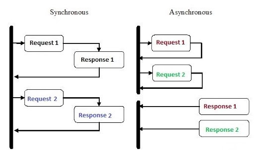
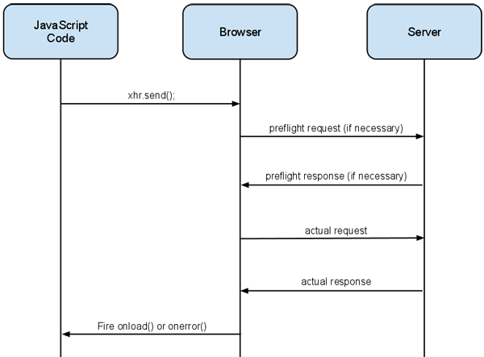

# Quest 09. 서버와 클라이언트의 대화

## Introduction
* 이번 퀘스트에서는 서버와 클라이언트의 연동, 그리고 웹 API의 설계 방법론 중 하나인 REST에 대해 알아보겠습니다.

## Topics
* expressJS, fastify
* AJAX, `XMLHttpRequest`, `fetch()`
* REST, CRUD
* CORS

## Resources
* [Express Framework](http://expressjs.com/)
* [Fastify Framework](https://www.fastify.io/)
* [MDN - Fetch API](https://developer.mozilla.org/en-US/docs/Web/API/Fetch_API)
* [MDN - XMLHttpRequest](https://developer.mozilla.org/en-US/docs/Web/API/XMLHttpRequest)
* [REST API Tutorial](https://restfulapi.net/)
* [CRUD](https://en.wikipedia.org/wiki/Create,_read,_update_and_delete)
* [MDN - CORS](https://developer.mozilla.org/en-US/docs/Web/HTTP/CORS)

## Checklist
### 비동기 프로그래밍이란 무엇인가요?

하나의 요청이 처리되어 완료되기 전에 제어권을 다음 요청으로 넘겨 Blocking 되지 않게 하는 프로그래밍

---

### 콜백을 통해 비동기적 작업을 할 때의 불편한 점은 무엇인가요? 콜백지옥이란 무엇인가요?

독립적이고 단순한, 비동기로 처리되야하는 동작을 콜백으로 처리하면 크게 문제가 없지만 그 처리의 결과로 다시 비동기적인 동작들이 생기면서 중첩이 된다면 인덴트의 깊이가 감당할 수 없을정도로 깊어지고 가독성이 떨어지는것을 콜백지옥 이라고 합니다. 단순히 가독성 뿐만 아니라 코드상의 메인 흐름의 타이밍과 실제 실행되고 처리되는 코드가 멀어져 복잡도가 기하 급수적으로 늘어나고, 코드를 추적하기가 매우 힘들어 집니다. 또한 콜백함수를 전달함으로 콜백함수 실행에 대한 제어권을 잃게 된다.

---

### 자바스크립트의 Promise는 어떤 객체이고 어떤 일을 하나요?

Promise는 자바스크립트 비동기 처리에 사용되는 객체입니다. 미래의 완료 또는 실패와 그 결과 값을 나타냅니다.  즉, 프로미스를 비동기 처리가 종료된 이후의 결과값이나 실패를 처리하기 위한 처리기와 연결하여 미래의 어떤 시점에 결과를 제공하여 비동기 메소드를 마치 동기 메소드 처럼 사용할 수 있습니다.

비동기 작업을 순차적으로 진행하여야 하는 경우 체이닝을 통해 가독성이 좋아지고, 비동기처리를 객체로 변수처럼 다루어 원하는 시점에 사용하여 지연평가등이 가능해 집니다.

---

### 자바스크립트의 `async`와 `await` 키워드는 어떤 역할을 하며 그 정체는 무엇일까요?

- 비동기 프로그래밍을 동기 방식처럼 직관적으로 표현할 수 있음
- iterator 개념에서 시작되어 generator로 발전하고 promise가 합쳐진 스펙

---

### 브라우저 내 스크립트에서 외부 리소스를 가져오려면 어떻게 해야 할까요?

?

---

### 브라우저의 `XMLHttpRequest` 객체는 무엇이고 어떻게 동작하나요?

원래 웹 페이지의 로딩은 간단했습니다. 서버에 웹 사이트 요청을 보내고 응답된 리소스를 렌더링 하였습니다. 하지만 페이지의 특정 부분을 업데이트 하기위해서 전체 페이지를 다시 로드하여야 했고 페이지가 점점 커지고 복잡해짐에 따라 낭비가 매우 심하고 사용자 경험이 저하되었습니다.

이로인해 웹 페이지에서 작은 데이터 청크(HTML, XML, JSON 등)을 요청하고 필요할 때만 표시할 수 있는 기술이 개발되었습니다(AJAX).

XMLHTTPRequestor는 이러한 기능을 수행하게 해주는 API 중 하나입니다.

- 서버와 비동기 상호작용 하기 위한 객체
- 전체 페이지의 새로고침 없이도 데이터를 받아올 수 있음
- 동작
  1. Create an XMLHttpRequest object
  2. Define a callback function
  3. Open the XMLHttpRequest object
  4. Send a Request to a server

---

### `fetch` API는 무엇이고 어떻게 동작하나요?

Fetch API는 기본적으로 XHR를 대체하는 최신 버전의 API입니다. javascript에서 비동기 HTTP요청을 더 쉽게 수행할 수 있게 도와줍니다.

- `let promise = fetch(url, [options])`
  - **`url`** – 접근하고자 하는 URL
  - **`options`** – 선택 매개변수, method나 header 등을 지정할 수 있음
  - options에 아무것도 넘기지 않으면 요청은 GET 메서드로 진행되어 url로부터 콘텐츠가 다운로드 됩니다.
- fetch를 호출하면 브라우저는 요청을 보내고 Promise 객체를 반환합니다.
- 요청이 완료되면 성공 여부에 상관없이 Promise가 resolved 되어 Response 객체가 반환됩니다. (404, 500 같은 경우와 같은 응답 코드를 받은 경우는 에러를 일으키지 않습니다.)
- 응답 헤더를 보고 요청이 성공적으로 처리되었는지 아닌지를 확인할 수 있습니다.
  - 네트워크 문제나 존재하지 않는 사이트에 접속하려는 경우같이 HTTP 요청을 보낼 수 없는 상태에선 프라미스는 거부상태가 됩니다.
  - HTTP 상태는 응답 프로퍼티를 사용해 확인할 수 있습니다.
    - **`status`** – HTTP 상태 코드(예: 200)
    - **`ok`** – 불린 값. HTTP 상태 코드가 200과 299 사이일 경우 `true`
- HTTP 요청이 완료되지 못한 상태라면 Promise가 rejected 됩니다. 이 경우 catch 메서드를 사용하여 에러를 처리할 수 있습니다. (네트워크 문제 및 존재하지 않는 사이트에 대한 요청에 해당합니다.)
- `text()`, `arrayBuffer()`, `blob()`,  `json()` , `formData()` 의 메소드로 (Promise를 return) 응답 본문을 처리할 수 있습니다.

---

### REST는 무엇인가요?

REST API(REpresentational State Transfer)는 웹상에서 사용되는 여러 리소스를 HTTP URI로 표현하고, 해당 리소스에 대한 행위를 HTTP Method로 즉, 웹에서 데이터를 전송하고 저리하는 방법을 정의한 인터페이스

- 구성
  - **자원(RESOURCE)** - URI
  - **행위(Verb)** - HTTP METHOD
  - **표현(Representations)**
- 특징
  1. Uniform (유니폼 인터페이스)
    - URI로 지정한 리소스에 대한 조작을 통일되고 한정적인 인터페이스로 수행하는 아키텍처 스타일
  2. Stateless (무상태성)
    - 작업을 위한 상태정보를 따로 저장하고 관리하지 않음
    - 세션 정보나 쿠키정보를 별도로 저장하고 관리하지 않기 때문에 API 서버는 들어오는 요청만을 단순히 처리
    - 서비스의 자유도가 높아지고 서버에서 불필요한 정보를 관리하지 않음으로써 구현이 단순해짐
  3. Cacheable (캐시 가능)
    - HTTP라는 기존 웹표준을 그대로 사용
    - 웹에서 사용하는 기존 인프라를 그대로 활용 가능
    - HTTP가 가진 캐싱 기능이 적용 가능
    - HTTP 프로토콜 표준에서 사용하는 Last-Modified태그나 E-Tag를 이용하면 캐싱 구현이 가능
  4. Self-descriptiveness (자체 표현 구조)
    - REST API 메시지만 보고도 이를 쉽게 이해 할 수 있는 자체 표현 구조
  5. Client - Server 구조
    - REST 서버는 API 제공, 클라이언트는 사용자 인증이나 컨텍스트(세션, 로그인 정보)등을 직접 관리하는 구조로 각각의 역할이 확실히 구분
    - 클라이언트와 서버에서 개발해야 할 내용이 명확해지고 서로간 의존성이 줄어듬
  6. 계층형 구조
    - REST 서버는 다중 계층으로 구성 가능
    - 보안, 로드 밸런싱, 암호화 계층을 추가해 구조상의 유연성을 둘 수 있음
    - PROXY, 게이트웨이 같은 네트워크 기반의 중간매체를 사용할 수 있음

- REST API는 어떤 목적을 달성하기 위해 나왔고 어떤 장점을 가지고 있나요?
  - 웹(HTTP) 설계의 우수성에 비해 제대로 사용되어지지 못하는 모습에 안타까워하며 웹의 장점을 최대한 활용할 수 있는 아키텍처로써 REST를 발표
  - 쉬운사용
  - REST API 메시지를 읽는 것 만으로도 메시지가 의도하는 바를 명확하게 파악 가능
    - Stateless하기 때문에 서버가 클라이언트의 컨텍스트를 관리할 필요 없음
- RESTful한 API 설계의 단점은 무엇인가요?
  - 표준의 부재
  - 안티패턴으로 설계될 가능성이 높음
  - 메소드 형태가 제한적

---

### CORS란 무엇인가요? 이러한 기능이 왜 필요할까요? CORS는 어떻게 구현될까요?

보안상의 이유로 스크립트에서 데이터를 요청 할때 프로토콜, 호스트, 포트가 같아야지 요청이 가능합니다. 이런 정책을 SOP (Same Origin Policy) 라고 합니다. 그러나 REST API 등의 외부 호출이 많아지고, 여러 도메인에 대규모로 분리되어 구성되는 웹 프로젝트가 많아 지면서 오히려 불편한 정책이 되었고 브라우저에서 외부 도메인 서버와 통신하기 위한 방식을 표준화한 스펙이 `CORS` 입니다.

- **Prefilight Request**
  - 브라우저는 실제 요청을 전송하기 전에 OPTIONS 메소드를 이용해서 preflight 요청을 서버로 전송
  - preflight 요청을 받은 서버는 CORS 관련 정보를 헤더에 담아서 아래와 같은 응답을 클라이언트로 전송
- **Request Header**
  - Access-Control-Request-Method : 실제 요청 때 사용할 메소드
  - Access-Control-Request-Headers : 브라우저가 실제 요청을 보낼 때 헤더에 추가할 커스텀 속성
- **Response Header**
  - Access-Control-Allow-Origin : 허용하는 Origin
  - Access-Control-Request-Methods : 허용하는 요청 메소드
  - Access-Control-Allow-Headers : 허용하는 헤더 속성
  - Access-Control-Max-Age : preflight request 캐시하는 시간(초 단위)
- **With Credentials**
  - 표준 CORS 요청은 기본적으로  Non-Credential 요청으로 쿠키를 전송하지 않음
  - 쿠키를 요청에 포함하고 싶으면  withCredentials 속성값을 true

## Quest
* 이번 퀘스트는 Midterm에 해당하는 과제입니다. 분량이 제법 많으니 한 번 기능별로 세부 일정을 정해 보고, 과제 완수 후에 그 일정이 얼마나 지켜졌는지 스스로 한 번 돌아보세요.
  * 이번 퀘스트부터는 skeleton을 제공하지 않습니다!
* Quest 05에서 만든 메모장 시스템을 서버와 연동하는 어플리케이션으로 만들어 보겠습니다.
  * 클라이언트는 `fetch` API를 통해 서버와 통신합니다.
  * 서버는 8000번 포트에 REST API를 엔드포인트로 제공하여, 클라이언트의 요청에 응답합니다.
  * 클라이언트로부터 온 새 파일 저장, 삭제, 다른 이름으로 저장 등의 요청을 받아 서버의 로컬 파일시스템을 통해 저장되어야 합니다.
    * 서버에 어떤 식으로 저장하는 것이 좋을까요?
  * API 서버 외에, 클라이언트를 띄우기 위한 서버가 3000번 포트로 따로 떠서 API 서버와 서로 통신할 수 있어야 합니다.
  * Express나 Fastify 등의 프레임워크를 사용해도 무방합니다.
* 클라이언트 프로젝트와 서버 프로젝트 모두 `npm i`만으로 디펜던시를 설치하고 바로 실행될 수 있게 제출되어야 합니다.
* 이번 퀘스트부터는 앞의 퀘스트의 결과물에 의존적인 경우가 많습니다. 제출 폴더를 직접 만들어 제출해 보세요!

## Advanced
- `fetch` API는 구현할 수 없지만 `XMLHttpRequest`로는 구현할 수 있는 기능이 있을까요?
  - Progress events
  - Synchronous requests
  - API 차원에서의 Timeout
- REST 이전에는 HTTP API에 어떤 패러다임들이 있었을까요? REST의 대안으로는 어jd떤 것들이 제시되고 있을까요?
  - ~~COBRA~~
  - ~~RMI~~
  - SOAP
