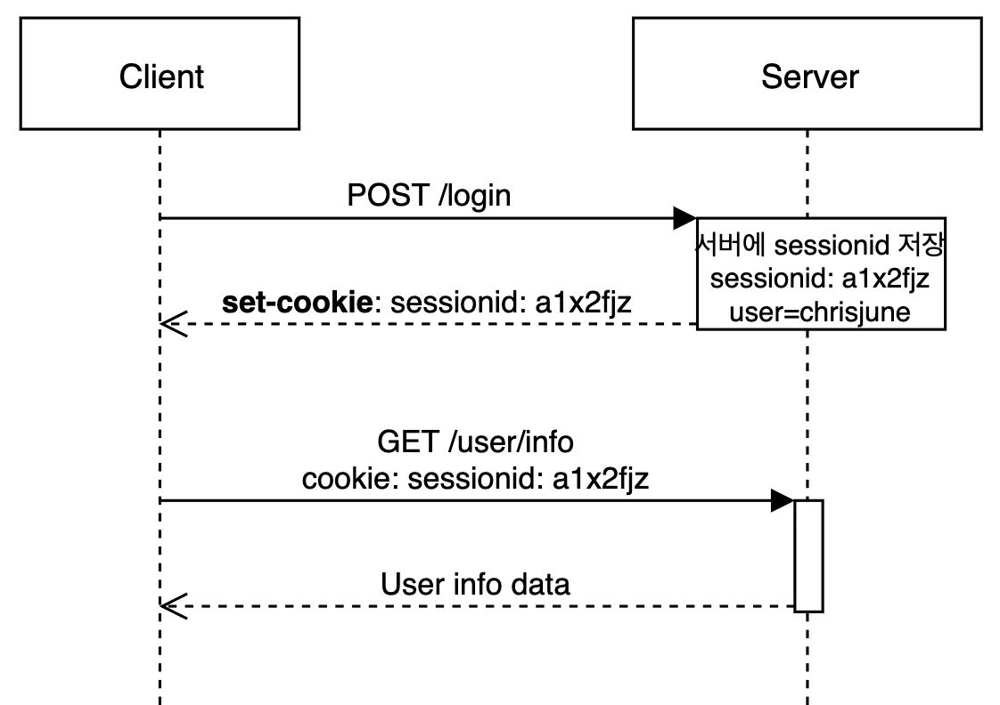
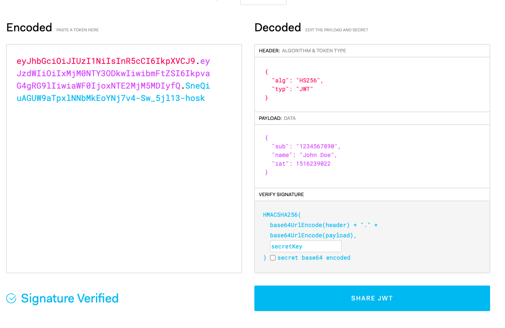
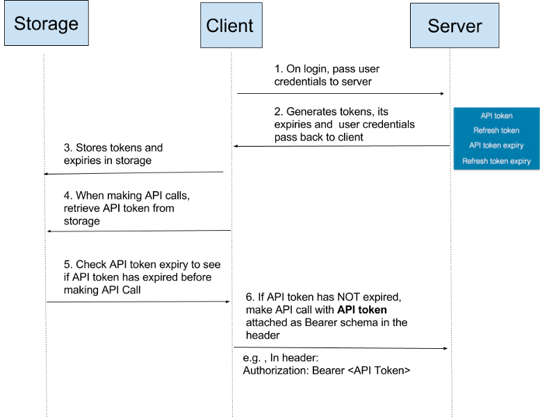
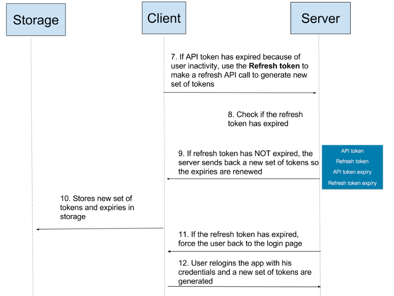

# Quest 10. 인증의 이해

## Introduction
* 이번 퀘스트에서는 웹에서의 인증에 관해 알아보겠습니다.

## Topics
* Cookie
* Session
* JWT

## Resources
* [MDN - HTTP 쿠키](https://developer.mozilla.org/ko/docs/Web/HTTP/Cookies)
* [Cookies and Sessions](https://web.stanford.edu/~ouster/cgi-bin/cs142-fall10/lecture.php?topic=cookie)
* [JWT](https://jwt.io/)

## Checklist
### 쿠키란 무엇일까요?

- 서버가 사용자의 웹 브라우저에 전송하는 작은 데이터 조각
  - 클라이언트(브라우저) 로컬에 저장되는 키와 값이 들어있는 작은 데이터
- 브라우저는 그 데이터 조각들을 저장해 놓았다가, 동일한 서버에 재 요청 시 저장된 데이터를 함께 전송
  - 특별한 제약 등을 정의하지 않으면 사용자가 따로 요청하지 않아도 브라우저가 Request시에 Request Header를 넣어서 자동으로 서버에 전송
- 쿠키는 요청이 동일한 브라우저에서 들어왔는지 아닌지를 판단할 때 주로 사용
- 주 목적
  - 세션 관리(Session management)
    - 서버에 저장해야 할 로그인, 장바구니, 게임 스코어 등의 정보 관리
  - 개인화(Personalization)
    - 사용자 선호, 테마 등의 세팅
  - 트래킹(Tracking)
    - 사용자 행동을 기록하고 분석하는 용도

**쿠키는 어떤 식으로 동작하나요? 쿠키는 어떤 식으로 서버와 클라이언트 사이에 정보를 주고받나요?**

1. 클라이언트가 페이지를 요청
2. 서버에서 쿠키를 생성
3. HTTP 헤더에 쿠키를 포함 시켜 응답
4. 브라우저가 종료되어도 쿠키 만료 기간이 있다면 클라이언트에서 보관하고 있음
5. 같은 요청을 할 경우 HTTP 헤더에 쿠키를 함께 보냄
6. 서버에서 쿠키를 읽어 이전 상태 정보를 변경 할 필요가 있을 때 쿠키를 업데이트 하여 변경된 쿠키를 HTTP 헤더에 포함시켜 응답

```json
ex)

Set-Cookie: id=a3fWa; Expires=Wed, 21 Oct 2015 07:28:00 GMT; Secure; HttpOnly
```

- 라이프타임
  - Session 쿠키 - 세션 종료시 제거
  - Permanent 쿠키 - Max-Age or Expires 옵션
    - Max-Age: 명시된 기간 이후에 삭제
    - Expires: 시된 날짜에 삭제
- Secure
  - HTTPS 프로토콜 상에서 암호화된 요청일 경우에만 전송 (HTTP시 쿠키 전송X)
- HttpOnly 플래그
  - 자바스크립트에서 Document.cookie API로 쿠키에 접근할 수 없게함.

---

### 웹 어플리케이션의 세션이란 무엇일까요?

- 서버에서 클라이언트를 구분하기 위한 단위, 임시 공간, 클라이언트의 상태를 일정하게 유지하는 기술
- 혹은 서버측에서 클라이언트를 식별하기위해 생성한 위의 정보들을 가지고 있는 데이터를 의미
- 생성된 식별자(SessionId)에 맵핑되는 데이터는 서버만 알고 있기 때문에 쿠키로 SessionId가 아닌 클라이언트의 정보를 전송하는것 보다 보안적으로 유리



**세션의 ID와 내용은 각각 어디에 저장되고 어떻게 서버와 교환되나요?**

1. 클라이언트는 서버로 http 요청을 한다.
2. 서버는 접근한 클라이언트의 쿠키를 확인해서, 클라이언트가 해당 SessionId를 보내왔는지 확인한다.
3. 만일 보내지 않았으면, 서버는 새롭게 SessionId를 생성해서, 클라이언트에게 set-cookie값으로 SessionId를 보낸다. (세션 데이터는 서버의 로컬 혹은 별도의 스토리지에 저장)
4. 클라이언트는 다음부터 요청을 할 때, 전달받은 SessionId 쿠키를 자동으로 헤더에 추가해서 요청을 한다.
5. 요청헤더의 SessionId값을 저장된 세션저장소에서 찾아보고 유효한지 확인 후에 요청을 처리하고 응답해준다.

서버가 세션을 생성(세션ID와 정보 맵핑 데이터)하면 어딘가에 저장을 해놓아야 합니다.

다중 서버 환경 기준으로(스케일 아웃)

- Sticky Session (여러대의 서버가 로컬 스토리지로 세션을 구성할때)
  - 각각의 서버는 독립적인 세션을 갖고 있음
  - 앞단의 로드밸런서가 요청에 대해 세션이 생성된 서버로 리다이렉트
  - 특정 서버에 트래픽이 집중될 위험이 있음
  - 특정 서버에 장애가 발생하면 해당 서버를 사용하는 세션 정보를 잃게 됨 (가용성 떨어짐)
- 세션 클러스터링
  - 분산된 각각의 서버가 세션을 복제하여 공유함(all-to-all, primary-secondary 방식 등)
  - 특정 서버에 장애가 발생 하더라도 세션 유지 가능
  - 모든 서버가 동일한 세션 객체를 가져야 함으로 많은 메모리가 필요
  - 서버가 늘어날수록 세션을 복제하는데 드는 비용이 많이 증가
- 세션 스토리지 분리
  - 별도의 분리된 세션 스토리지를 구성하고 각 서버는 이 스토리지에 세션 데이터를 읽고 씀
  - 서버가 아무리 늘어나더라도 세션 스토리지에 대한 접근만 설정해주면 세션 공유 가능
  - 어떤 형태든 상관 없지만 보통은 인메모리 기반의 Redis, Hazelcast 등을 많이 사용 (퍼포먼스)

---

### JWT란 무엇인가요?

JWT(JSON Web Token)는 일반적으로 클라이언트와 서버, 서비스와 서비스 사이 통신 시 권한 인가(Authorization)를 위해 사용하는 토큰입니다. URL에대해 안전한 문자열로 구성되어 있기 때문에 HTTP 어디든(URL, Header, ...) 위치할 수 있습니다.

특징

- Self-contained ( 자가 수용적 ): JWT 자체적으로 필요한 모든 정보를 포함합니다. 헤더 정보와, 실제 전달할 데이터, 검증할 수 있는 서명 데이터를 모두 포함하고 있습니다.
- 신뢰할 수 있다: JWT는 디지털 서명에 의해 검증할 수 있으며 신뢰할 수 있습니다. 비밀 값을 사용하는 HMAC 알고리즘이나 RDS or ECDSA와 같은 공개키, 개인키 쌍으로 서명될 수 있습니다.

JWT 의 주요한 이점은 사용자 인증에 필요한 모든 정보는 토큰 자체에 포함하기 때문에 별도의 인증 저장소가 필요없다는 것입니다.


1. Header
  - 토큰의 타입과 서명에 사용된 해시 알고리즘이 Base64(URL-Safe)로 인코딩 되어 생성
2. Payload
  - 클레임: 객체나 추가적인 데이터 표현
    - payload에 담는 정보의 한 조각을 한 클레임 이라고 부르고 key-value 쌍으로 이루어짐
  - 클레임의 종류로는 Registered claims, Public claims, Private Claims 가 있음
  - JSON객체를 Serialize하고 Base64(URL-safe)로 인코딩하여 생성
3. Signature
  - Header와 Payload를 주어진 Secret key로 해싱한 값



**JWT 토큰은 어디에 저장되고 어떻게 서버와 교환되나요?**

- 토큰의 종류와 정책에 보통 따라 쿠키나 웹스토리지에 저장






예시

- 사용자가 ID, PW를 입력하여 서버에 로그인 인증을 요청
- 서버는 사용자로 부터 받은 ID, PW를 확인한 후 secret key를 통해서 Access Token(JWT)과 Refresh Token을 발급
- JWT가 요구되는 API를 요청할 때 클라이언트가 Authorization header에 Access Token을 담아서 보냄
- 서버는 JWT Signature를 체크하여 중간에 위변조 되었는지 확인. 이상이 없으면 Payload로 부터 사용자의 정보를 확인해 요청에 맞는 정보를 응답
- 액세스 토큰의 시간이 만료되면 클라이언트는 리프래시 토큰을 이용해서 새로운 엑세스 토큰을 발급

---

### 세션 vs JWT

JWT(Json Web Token)란 Json 포맷을 이용하여 사용자에 대한 속성을 저장하는 Claim 기반의 Web Token이다. JWT는 토큰 자체를 정보로 사용하는 Self-Contained 방식으로 정보를 안전하게 전달한다. 주로 회원 인증이나 정보 전달에 사용되는 JWT는 아래의 로직을 따라서 처리된다.

- 세션
  - 검증을 위한 별도의 세션 저장소가 필요
    - 스케일아웃 하기 까다로움    
    - 해당 저장소에 장애가 생기면 모든 서버에 영향
    - IO로 인한 부하 발생
  - 세션을 관리할 때 자주 사용되는 쿠키는 단일 도메인, 서브 도메인에서만 작동하기 때문에 여러 도메인에서 관리하기 번거로움
  - 서버쪽에서 세션 관리 가능
  - 낮은 네트워크 부하
- JWT
  - 토큰 자체에 인증에 필요한 정보가 포함되어 별도의 인증 저장소 필요하지 않음
    - IO없이 토큰을 검증 하기만 하면 됨
  - 다양한 도메인에서 사용 가능 & 다양한 플랫폼에서 지원하기 원할
  - 이미 발급된 토큰은 무효화 시키기 까다로움
  - 데이터 증가에 따른 네트워크 부하
  - 토큰 자체에 정보를 담고 있음

## Quest
* 이번에는 메모장 시스템에 로그인 기능을 넣고자 합니다.
  * 사용자는 딱 세 명만 존재한다고 가정하고, 아이디와 비밀번호, 사용자의 닉네임은 하드코딩해도 무방합니다.
  * 로그인했을 때 해당 사용자가 이전에 작업했던 탭들과 마지막으로 활성화된 탭 등의 상태가 로딩 되어야 합니다.
  * 세션을 이용한 버전과, JWT를 이용한 버전 두 가지를 만들어 보세요!
    * 세션을 이용할 경우 세션은 서버의 메모리나 파일에 저장하면 됩니다.

## Advanced
### Web Authentication API(WebAuthn)은 무엇인가요?

- WebAuthn은 서비스 기관이 모든 주요 브라우저 및 플랫폼에 내장된 지원을 통해 강력한 인증을 애플리케이션에 쉽게 통합할 수 있도록 하는 API
- 웹 서비스가 보안 키와 같은 인증자 또는 생체 인식기와 같은 내장 플랫폼 인증자를 통해 사용자에게 강력한 인증을 쉽게 제공할 수 있음을 의미
- 웹 및 모바일 애플리케이션에 대한 강력한 인증 통합을 크게 단순화하고 표준화
- 웹 사이트에 등록하고 인증하기 위해 브라우저 및 플랫폼에 내장된 피싱 보호 기능과 함께 비대칭(공용 키) 암호화를 사용
