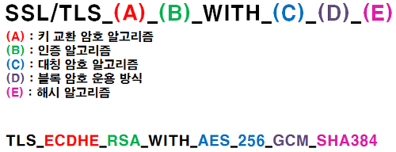

# Quest 12. 보안의 기초

## Introduction
* 이번 퀘스트에서는 가장 기초적인 웹 서비스 보안에 대해 알아보겠습니다.

## Topics
* XSS, CSRF, SQL Injection
* HTTPS, TLS

## Resources
* [The Basics of Web Application Security](https://martinfowler.com/articles/web-security-basics.html)
* [Website Security 101](https://spyrestudios.com/web-security-101/)
* [Web Security Fundamentals](https://www.shopify.com.ng/partners/blog/web-security-2018)
* [OWASP Cheat Sheet Series](https://cheatsheetseries.owasp.org/)
* [Wikipedia - TLS](https://en.wikipedia.org/wiki/Transport_Layer_Security)

## Checklist

---

### 입력 데이터의 Validation을 웹 프론트엔드에서 했더라도 서버에서 또 해야 할까요? 그 이유는 무엇일까요?

- 프론트엔드의 검증은 회피하거나 변조가 가능함.
- 데이터의 무결성을 보장하기 위해

---

### 서버로부터 받은 HTML 내용을 그대로 검증 없이 프론트엔드에 innerHTML 등을 통해 적용하면 어떤 문제점이 있을까요?

- 악의적으로 작성된 스크립트를 실행할 수 있다.

---

### XSS(Cross-site scripting)이란 어떤 공격기법일까요?

- XSS?
  - 관리자가 아닌 권한이 없는 사용자가 웹 사이트에 스크립트를 삽입하는 공격 기법
  - 대부분 사용자가 글을 쓰고 읽을 수 있는 게시판에 많이 발생하지만, 사용자의 입력 값을 웹 페이지에 보여주는 곳에서도 발생
- 분류
  - Persistent XSS
    - 지속적으로 피해를 입히는 XSS 공격
    - 사용자의 입력이 서버에 저장되고 이를 지속적으로 서비스를 제공하는 페이지의 입력에 악의적인 코드를 삽입하여 해당 페이지를 열람하는 사용자들은 악성스크립트가 작동하면서 쿠키를 탈취당한다던가, 혹은 다른 사이트로 리다이렉션 되는 공격을 받게 됨
    - ⇒ 게시글에 스크립트를 악성 스크립트를 삽입
  - Reflected XSS
    - Reflected XSS 공격은 사용자에게 입력 받은 값을 서버에서 되돌려 주는 곳에서 발생
    - 사용자에게 입력 받은 검색어를 그대로 보여주는 곳이나 사용자가 입력한 값을 에러 메세지에 포함하여 보여주는 곳에 악성스크립트가 삽입되면, 서버가 사용자의 입력 값을 포함해 응답해 줄 때 스크립트가 실행
    - ⇒ 쿼리 param을 검색어로 검색어와 검색결과를 보여주는 검색기능이 있으면 URL에 악성스크립트를 쿼리스트링으로 삽입
  - DOM based XSS
    - DOM을 이용해서 요소들을 수정하거나 추가하는 등의 행위를 할 때 발생하는 XSS 취약점

---

### CSRF(Cross-site request forgery)이란 어떤 공격기법일까요?

- CSRF
  - 특정 사이트가 사용자의 브라우저를 신뢰한다는 점을 공격
  - 자신의 의지와는 무관하게 공격자가 의도한 행위(수정, 삭제, 등록 등)를 특정 웹사이트에 요청하게 만든는 공격
  - 적절한 권한을 가지고 있는 시스템 관리자가 엉뚱한 URL을 실행하도록 만드는 것
- 예시
  - A라는 사이트의 관리자 권한을 갖고 있는 유저가 A라는 사이트에 로그인되어 있는 상태이고
  - A라는 사이트에 관리자가 유저의 권한을 변경할 때 사용되는 다음과 같은 URL이 있다고 할 때
  - GET /changeUserAuth?id=programmer93&auth=ROLE_ADMIN ( programmer93의 권한을 admin으로 변경 )
  - 공격자가 사용자한테 무작위 이메일을 보낼 때 해당 url이 걸려있는 아래와 같은 이미지 태그를 추가한다.
  - ``
  - 이 이메일을 여는 순간 브라우저는 img 태그에 있는 src 주소에 가서 이미지를 가져오려고 해당 주소에 접속한다.
  - 이때 A 사이트에 이미 로그인 되어 있는 관리자 권한의 유저이기에 해당 URL에 접속이 되면서 공격이 성공한다.

---

### SQL Injection이란 어떤 공격기법일까요?

- SQL Injection
  - 의적인 SQL문을 실행시켜 데이터베이스를 비정상적으로 조작
  - 보통 사용자의 입력으로 SQL 쿼리를 실행하는 경우 공격자가 개발자가 의도한 쿼리가 아닌 공격자의 악의적인 쿼리를 실행 시킨다.

---

### 대부분의 최신 브라우저에서는 HTTP 대신 HTTPS가 권장됩니다. 이유가 무엇일까요?

- **보안**
  - 전송되는 데이터를 누군가 볼 수 있다.
    - 암호화
  - 목적지가 신뢰 할 수 있는 곳인지 알 수 없다.
    - 인증 - HTTPS를 통해 웹사이트의 진위 여부를 확인
  - 전송된 메세지가 변조된 것인지 확인 할 수 없다.
    - 무결성 - message digest 알고리즘, MAC(message authentication codes)
    - 양쪽이 공유한 키를 키반으로 해싱된 MAC을 메세지와 함께 보내 수신측에서 메세지를 해싱하여 동일한지 확인
- **SEO**
  - 구글이 HTTPS 웹사이트에 가산점
- **AMP(Accelerated Mobile Pages)**
  - AMP란 모바일 기기에서 훨씬 빠르게 콘텐츠를 로딩 하기 위한 방법

---

### HTTPS와 TLS는 어떤 식으로 동작하나요? HTTPS는 어떤 역사를 가지고 있나요?

- TLS 1.2
  - PRE
    - 브라우저는 CA의 리스트와 Public Key를 가지고 있다.
    - 서버는 서버의 Public Key를 포함한 TLS/SSL 인증서를 CA로부터 발급 받는다.
      - 인증서는 CA의 Private Key로 암호화 되어있음
      - 인증서에는 Public Key와 인증기관에 대한 정보 등이 포함
  - Client Hello
    - 클라이언트가 서버에게 Client random 및 지원하는 프로토콜, 암호화 방식 등을 서버 에게 전송
  - Server Hello
    - 서버는 클러이언트에게 인증서, Server random, 협의된 암호화 방식 및 관련 정보들을 전송
  - Client key exchange
    - 클라이언트는 서버의 인증서를 확인하여 자신이 아는 CA의 인증서라면 미리 알고 있던 CA의 Public  Key로 인증서의 서버 Public키를 복호화 ⇒ 서버의 Public Key 획득
    - 클라이언트는 소유한 Pre-master secret을 생성하고 위에서 획득한 서버의 Public Key로 암호화 후 서버에 전송
    - 서버는 Private Key로 해당 데이터를 복호화 하여 Pre-master secret 획득
    - Key Derivation - 클라이언트와 서버는 이전에 가지고 있던 Client random, Server random, Pre-master secret의 조합으로 Master secret으로 확장후 대칭키로 사용될 Session Key를 유도한다
    - 서버와 클라이언트가 서로 공유된 Session Key를 이용하여 암호화된 통신을 한다.
- TLS 1.3
  - 취약성이 존재하는 알고리즘 제거
  - Handshake 과정 기존 2-RTT(Round Trip Time) 에서 완전협상(1-RTT) / 단축 협상 (0-RTT)로 개선
  - SNI필드 암호화
- History
  - HTTPS는 통신의 인증과 암호화를 위해 1994년 넷스케이프 커뮤니케이션즈 코퍼레이션에서 개발
  - HTTPS는 소켓 통신에서 일반 텍스트를 이용하는 대신에, SSL이나 TLS 프로토콜을 통해 세션 데이터를 암호화 한다.
  - 기존에는 HTTPS는 SSL 프로토콜과 함께 사용 되었고, SSL이 TLS로 발전했을 때 2000년 5월 공식적으로 RFC2818에 규정 됨

---

### HTTPS의 서비스 과정에서 인증서는 어떤 역할을 할까요? 인증서는 어떤 체계로 되어 있을까요?

- 인증서는 클라이언트와 서버간의 통신을 보증해 주는 전자 인증 문서
  - 서버의 Public Key를 클라이언트 에게 제공
  - 클라이언트가 접속한 서버가 신뢰할 수 있는 서버 인것을 보증
- SSL 인증서는 CA (Certificate Authority, 인증 기관)라고도 하는 인증서 발급 회사에서 시작하는 ROOT 인증서에서 시작
- 인증서 체인
  - 일반적으로 인증서는 ROOT, Intermediate(중간 인증서), Leaf(서버 인증서) 3단계로 구성
  - 사용자가 구입하는 SSL 인증서는 Leaf 인증서를 의미하며 이는 인증서 체인의 일부이지 전체가 아님
  - 인증서 체인은 하위 구조의 인증서를 서명하고 상위 구조의 인증서를 참고하는 방식
- 루트 CA 인증서는 웹 브라우저의 특정 저장소에 포함되어 있고 일부 운영 체제에는 사전 설치되어 있기 때문에 따로 다운로드할 필요는 없음
- 루트 인증서를 발급한 기관이 운영 체제가 신뢰할 수 있는 루트 CA 목록에 없으면 인증서 자체는 신뢰할 수 있는 인증서가 아니라는 경고가 표시

---

## Quest
* 메모장의 서버와 클라이언트에 대해, 로컬에서 발행한 인증서를 통해 HTTPS 서비스를 해 보세요.

## **Advanced**

- TLS의 인증서에 쓰이는 암호화 알고리즘은 어떤 종류가 있을까요?

  **Cipher suite**

  

  - (A) 키교환 알고리즘 : Server와 Client간 Key를 교환할 방식을 선정하는 것입니다.
    - TLS 1.2 이전 - RSA, DHE, ECDHE, SRP, PSK
    - TLS 1.3 - DHE, ECDHE, PSK-ONLY, PSK-(EC)DHE
  - (B) 인증 알고리즘 : Server와 Client간 교환한 인증서를 확인하는 알고리즘입니다.
    - TLS 1.2 이전 - RSA, DSA, ECDSA
    - TLS 1.3 - RSA, EdDSA, ECDSA
  - (C) 대칭 암호 알고리즘 : 실제 데이터를 암호화 하는 알고리즘입니다.
  - (D) 블록 암호 운용 방식 : 데이터를 암호화 할때 한꺼번에 암호화 하는 것이 아니라 블록 단위로 암호화 하게 되는데, 블록된 암호화 패킷을 조합하여 데이터를 추측 하는 것을 방지하기 위한 방식입니다.
  - (E) 해시 알고리즘 : 서로 상대방이 암호화 한것이 맞는지 확인하기 위한 알고리즘
  - TLS 1.3에는 취약성이 존재하는 알고리즘 제거
- HTTP/3은 기존 버전과 어떻게 다를까요? HTTP의 버전 3이 나오게 된 이유는 무엇일까요?
  - UDP기반의 프토콜인 QUIC 사용
  - 기존 TCP 핸드쉐이크 과정을 최적화 하는것에 초점
    - TCP+TLS는 서로 자신의 세션 키를 주고 받아 암호화된 연결을 성립하는 과정을 거치고 나서야 세션 키와 함께 데이터를 교환할 수 있지만, QUIC은 서로의 세션 키를 교환하기도 전에 데이터를 교환할 수 있기 때문에 연결 설정이 더 빠르다는 것
    - 클라이언트가 서버로 첫 요청을 보낼 때는 서버의 세션 키를 모르는 상태이기 때문에 목적지인 서버의 Connection ID를 사용하여 생성한 특별한 키인 초기화 키(Initial Key)를 사용하여 통신을 암호화
    - 한번 연결에 성공했다면 서버는 그 설정을 캐싱해놓고 있다가, 다음 연결 때는 캐싱해놓은 설정을 사용하여 바로 연결을 성립
