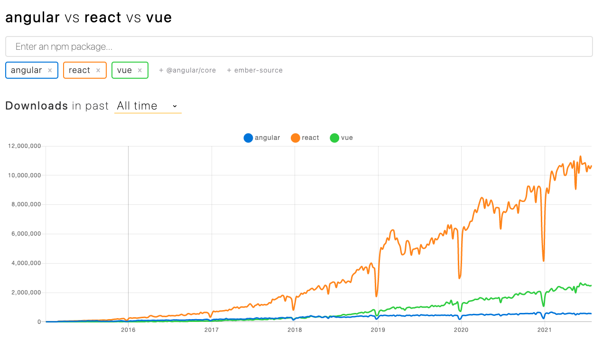

# Quest 16-F. 컴포넌트 기반 개발

## Introduction
* 이번 퀘스트에서는 Vue.js 프레임워크를 통해 컴포넌트 기반의 웹 클라이언트 개발 방법론을 더 자세히 알아보겠습니다.

## Topics
* Vue.js framework
* vuex
* Virtual DOM

## Resources
* [Vue.js](https://vuejs.org)
  * [Lifecycle Hooks](https://v3.vuejs.org/guide/composition-api-lifecycle-hooks.html)
  * [State Management](https://v3.vuejs.org/guide/state-management.html)
  * [Virtual DOM](https://v3.vuejs.org/guide/optimizations.html#virtual-dom)

## **Checklist**

- Vue.js는 어떤 특징을 가지고 있는 웹 프레임워크인가요?
  - 특징?
    - Virual DOM, 컴포넌트 기반 프레임워크 (MVVM)
    - 간편한 syntax, 낮은 러닝커브 (가독성, 직관적)
    - 한 파일에서 컴포넌트를 구성하는 템플릿, 스크립트, 스타일을 모두 작성하고 관리할 수 있다는 기본 철학
  - Vue.js는 내부적으로 어떤 식으로 동작하나요?

    큰 흐름에서는 상태 데이터의 변화를 감지하고 변화가 있으면 버추얼돔노드 구성하고 반영이 필요한곳을 리랜더링 한다.

    - **템플릿**
      - 컴포넌트의 탬플릿 코드를 파싱하여 AST 작성 (attributes, parent, children, tag 등등)
      - purely static 즉 절대 바뀔 필요가 없는 요소들 플래그 체크하여 최적화(리랜더링시 새로운 노드 생성X)
    - **Observer 와 Watcher (Reactive)**
      - **Observer**
        - 데이터의 변화를 감지한다
        - data 옵션으로 전달되는 객체의 모든 속성을 순회하며 `Object.defineProperty` (Vue3는 `Proxy`를 이용하여 구현됨) getter/setter(트랩)를 셋팅한다
        - 새로운 값으로 set 될경우 Watcher에게 notify 한다.
      - **Watcher**
        - Watcher는 Subscriber를 관리하고 notify 받으면 콜백을 실행(trigger)
        - 데이터가 변경 되었을때 동일한 이벤트 루프에서 발생하는 변경 사항을 큐에 버퍼링 한다.
          - 같은 watcher가 여러번 호출되어도 큐에는 최종적인 하나만
        - `nextTick` 함수는 버퍼된 큐를 실행(consume/flush)
        - 렌더 프로세스가 초기화 된다
    - **Patch process**
      - 처음 랜더 되는건지, 변경되야할 노드가 있는지 등 비교 로직을 기반으로
      - Virtual-DOM(VNode: Virtual DOM Node)을 이용하여 실제 DOM을 그린다
      - 필요하다면 스타일,클래스,dataset,이벤트 리스너 등도 업데이트 한다
- Vue.js에서의 컴포넌트란 무엇인가요?
  - 컴포넌트?
    - 조합하여 화면을 구성할 수 있는 블록
    - 엘리먼트를 확장하여 재사용 가능한 코드를 캡슐화하는 데 도움
  - Vue 컴포넌트의 라이프사이클은 어떤 식으로 호출되나요?
    - Vue의 라이프 사이클은 크게 4가지(Creation, Mounting, Updating, Destruction)의 before, after로 구성되어있다.
    - **Creation**
      - `beforeCreation` - Vue인스턴스가 초기화 된 직후
      - `created` - Vue가 데이터와 워쳐의 셋업이 끝난 후
    - **Mouting**
      - `beforeMount` - Patch process 전 (VNode가 실제 DOM에 부착 되기 전)
      - `mounted` - Patch process 후 (VNode가 실제 DOM에 부착 된 후)
    - **Updating**
      - `beforeUpdate` - 데이터 변화에 따라 Watcher가 VNode를 업데이트하고 Patch process (re-initiate)하기 전
      - `updated` - 위의 업데이트 (Patch process)가 끝난 후
    - **Destruction**
      - `beforeDestroy` - 인스턴스가 해체 되기 직전 (모든 속성 접근 가능, 보통 이벤트 리스너 제거 등)
      - `destroyed` - 인스턴스가 해체 된 후
- 컴포넌트 간에 데이터를 주고받을 때 단방향 바인딩과 양방향 바인딩 방식이 어떻게 다르고, 어떤 장단점을 가지고 있나요?
  - HTML 엘리먼트의 value가 변경되면 모델 데이터에 동기화가 되거나 영향을 미치는가
  - 단방향
    - Vue 인스턴스의 데이터 → HTML 엘리먼트 데이터
    - 코드를 이해하고
  - 양방향
    - Vue 인스턴스의 데이터 ⇄ HTML 엘리먼트 데이터
    - 코드량을 줄여줌
    - 퍼포먼스 감소 되는 경우 발생
  - 어짜피 Syntactic sugar 아닌가? 양방향 바인딩이란게 개념적인 양방향인지 프레임워크나 라이브러리가 제공하는 기능,문법 적인 양방향인지 모르겠음!
- Vue.js 기반의 웹 어플리케이션을 위한 상태관리 라이브러리에는 어떤 것이 있을까요? 이러한 상태관리 툴을 사용하는 것에는 어떤 장단점이 있을까요?
  - 라이브러리
    - Vuex
    - Redux
    - Apollo client
    - Revue
    - vue-stash
    - Vue Freeze
  - 장점
    - 전역 상태를 관리하는데 도움을 줌
    - 흐름을 읽기 비교적 쉬움, 예측 가능, 디버깅 용이
    - 여러 컴포넌트에서 함께 사용할 전역 상태를 정의
    - 컴포넌트에서 각 상태에 접근하는 방법(Props drilling해결)과 해당 상태를 변이시키는 방법을 제공
  - 단점
    - 상태관리 라이브러리의 자체의 문제는 아니지만 (상태야 관리만 잘하면 되니까?) 상태의 초기화, 로컬 상태와 서버 상태의 동기화를 위해 실제 원하는 동작은 단순한데 코드량이 많아지고 너무 많은 일을 해당 라이브러리가 하게 되어버린다.
    - 서버의 상태를 전역상태에서 캐싱 하게되면 특정 시점의 상태가 캡쳐 되버린다 ⇒ 서버의 상태와 데이터를 소비하는 시점의 전역상태가 같음을 보장할 수 없다. ⇒ 언제 어디서 동기화 할것인가? ⇒ 어딘가에서 동기화를 위한 호출이 강제된다면 데이터를 호출하는 시점과 데이터를 쓰는 시점이 달라진다.
    - 이런문제를 해결하기위해 recoil, swr, react-query등 상태관리, Data fetching 및 캐싱 움직임

## **Quest**

- Vue.js를 통해 메모장 시스템을 다시 한 번 만들어 보세요.
  - 어떤 컴포넌트가 필요한지 생각해 보세요.
  - 각 컴포넌트별로 해당하는 CSS와 자바스크립트를 어떤 식으로 붙여야 할까요?
  - Vue.js 시스템에 타입스크립트는 어떤 식으로 적용할 수 있을까요?
  - 컴포넌트간에 데이터를 주고받으려면 어떤 식으로 하는 것이 좋을까요?
  - `vue-cli`와 같은 Vue의 Boilterplating 기능을 이용하셔서 세팅하시면 됩니다.

## **Advanced**

- React와 Angular는 어떤 프레임워크이고 어떤 특징을 가지고 있을까요? Vue와는 어떤 점이 다를까요?
  - React
    - VDOM
    - JSX
    - 커뮤니티
    - 페이스북
  - Angular
    - 자체적으로 제공하는 라이브러리나 가이드가 많음
    - 체계적이고 잘 정리되어있는 문서
    - 복잡하고 큰 러닝커브
    - 양방향 바인딩
    - TS
- Web Component는 어떤 개념인가요? 이 개념이 Vue나 React를 대체하게 될까요?
  - 재사용 가능한 독립적인 컴포넌트, 컴포넌트 기반 프로그래밍을 웹에 적용할 수 있도록 한 스펙
  - 프레임워크와 비교대상이 아니라고 생각한다. 프레임워크가 사용하는 하나의 모듈이 될 수는 있어도 프레임워크를 대체할 순 없다고 생각한다. 결과물이 웹 컴포넌트가 될 수는 있어도 개발자 입장에서 코드 작성자체는 또 다른 프레임워크, 라이브러리가 필요할 것이다.(그게 프레임워크, 라이브러리의 존재이유?)
  - 개인적으로는 옛날부터 꼭 일년, 몇년에 한번씩 꼭 "웹 컴포넌트!!" 하면서 이야기가 나오는데 사례를 경험하기 쉽지 않은걸 보면 아직은(혹은 앞으로도) 힘들지 않을까 생각한다.
- Reactive Programming이란 무엇일까요?
  - 비동기 데이터의 스트림을 프로그래밍하는 개념
  - 하나의 데이터 스트림을 감시(구독)하는 대상이 있다면, 데이터 스트림의 변화가 발생할 경우 변화 전파가 일어나는데 감시하는 대상은 이를 감지하여 작업
