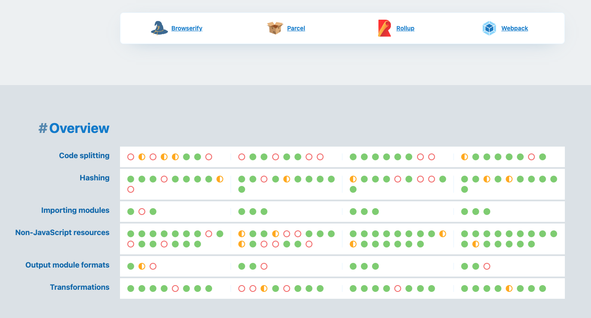

# Quest 17-F. 번들링과 빌드 시스템

## Introduction
* 이번 퀘스트에서는 현대적 웹 클라이언트 개발에 핵심적인 번들러와 빌드 시스템의 구조와 사용 방법에 대해 알아보겠습니다.

## Topics
* Webpack
* Bundling
  * Data URL
* Transpiling
  * Source Map
* Hot Module Replacement

## Resources
* [Webpack](https://webpack.js.org/)
* [Webpack 101: An introduction to Webpack](https://medium.com/hootsuite-engineering/webpack-101-an-introduction-to-webpack-3f59d21edeba)

## **Checklist**

- 여러 개로 나뉘어진 자바스크립트나 이미지, 컴포넌트 파일 등을 하나로 합치는 작업을 하는 것은 성능상에서 어떤 이점이 있을까요?
  - 네트워크 비용 감소(요청횟수)
- 이미지를 Data URL로 바꾸어 번들링하는 것은 어떤 장점과 단점이 있을까요?
  - 네트워크 요청 없이 이미지를 사용하기위해 Base64로 인코딩하여 data-uri로 인라인화
  - 이미지가 실제 파일의 용량보다 data-uri로 인코딩했을때 보통 30%정도 용량이 커짐
  - 커진 용량은 번들에 추가됨 (번들파일 크기가 커짐)
  - 클라이언트가 불필요한 리소스도 번들에 포함
- Source Map이란 무엇인가요? Source Map을 생성하는 것은 어떤 장점이 있을까요?
  - 개발자는 코드를 여러 파일과 여러 포맷으로 작성하지만 결국 그 코드는 여러 과정과 처리를 통해(번들링, 트랜스파일링 등) html+javascript+css의 형태로 브라우저 위에서 작동한다. 런타임에서 에러가 발생하면 브라우저에서 실행되는 코드는 에러가 부분이 실제 작성한 코드에서 어딘지 알 수 없다. Sourcemap을 생성하면 전략에 따라 실제 작성한 코드의 위치를 맵핑해주어 알 수 있다.
- Webpack의 필수적인 설정은 어떤 식으로 이루어져 있을까요?
  - Basic
    - Entry - 엔트리가 될 파일 (여기서부터 디팬던시 그래프)
    - Output - 번들된 결과물을 저장할 위치
    - Mode - 모드 (none, development, production)
    - Loader - 로더 설정
    - Plugin - 플러그인 설정
  - Webpack의 플러그인과 모듈은 어떤 역할들을 하나요?
    - 모듈(로더)
      - 로더는 코드를 분석하며 의존관계를 찾는 과정에서 형태에 맞는(예를 들면 `import 'foo.css';` 를 만나게 되면 해당하는 css 파일을 모듈화 시킨다던지) 모듈로 로드할 수 있게 도와준다.
    - 플러그인
      - 로더는 모듈을 로드하기 위해 사용하지만 플러그인은 번들된 결과물을 처리하거나 기타 작업들을 한다.
      - 예를 들면 번들링된 모듈을 난독화 한다던지, 압축 한다던지, 특정 파일들을 복사한다던지 추출 한다던지 등등
  - Webpack을 이용하여 HMR(Hot Module Replacement) 기능을 설정하려면 어떻게 해야 하나요?
    - 해당 설정을 설정을 한다. (flag 를 키거나, 플러그인을 직접 추가)

## **Quest**

- 직전 퀘스트의 소스만 남기고, Vue의 Boilerplating 기능을 쓰지 않고 Webpack 관련한 설정을 원점에서 다시 시작해 보세요.
  - 필요한 번들링과 Source Map, HMR 등의 기능이 모두 잘 작동해야 합니다.

## **Advanced**

- Webpack 이전과 이후에는 어떤 번들러가 있었을까요? 각각의 장단점은 무엇일까요?

  

[Overview | Tooling.Report](https://bundlers.tooling.report/)
