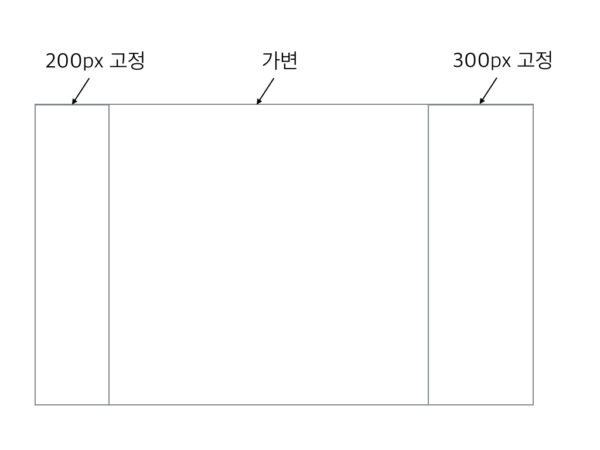

# KnowRe web development curriculum
---

## Introduction
---
- 이 커리큘럼은 KnowRe와 함께하게 된 초보 개발자를 위해 만들어진 커리큘럼입니다.
- 이 커리큘럼의 퀘스트들을 수행하는 데 있어서 다음 링크들의 필요한 부분을 참조하시면 좋습니다.
 - http://xguru.net/1897
 - http://nigayo.github.io/page/lecture.html


## git
---
### Hello, git
- Github에 가입해 보세요.
- git 명령어들을 익혀 보세요.
- **Quest: Tutorial for git**
 - https://try.github.io
 - http://pcottle.github.io/learnGitBranching/


## HTML & CSS
---
### Hello, HTML
- HTML 표준의 역사를 간략하게 알아 보세요.
 - HTML4.01, XHTML1.0, XHTML1.1, XHTML2.0, HTML5 등의 키워드는 중요합니다.
 - MS와 IE는 왜 역사의 죄인이 되었을까요?
- HTML 문서의 형식을 익혀 보세요.
- HTML 엘리먼트에는 무엇이 있는지 알아 보세요.
- [MDN](https://developer.mozilla.org/ko/docs/Web/HTML) 사이트를 활용하면 도움이 될 것입니다!
- **Quest: HTML Document**
 - gmail 목록 페이지를 HTML문서로 표현한다면 어떻게 될까요?
 - 소스를 보지 말고 한 번 자신만의 HTML 코드를 만들어 보세요.

### Hello, CSS
- CSS 문법을 익혀 보세요.
- CSS를 HTML에 적용하려면 어떻게 해야 할까요?
- CSS Box Model이 무엇인지 알아 보세요.
 - 가장 중요한 것: position, left/top, display, width/height
- 크롬 개발자 도구의 elements 탭을 사용하는 방법을 알아 보세요.
- **Quest: Layout**
 - CSS 박스를 다음과 같이 배치하려면 어떻게 해야 할까요?
    - 
    - 
    - 
 - 브라우저의 창 크기가 변하더라도 레이아웃이 깨지지 않도록 하려면 어떻게 해야 할까요?
- **Quest: Static HTML**
 - HTML과 CSS를 이용하여, gmail 목록 페이지를 흉내내 보세요.
 - 아이콘 그림은 아무렇게나 그려넣으셔도 상관 없습니다!


## JavaScript
---
### Hello, JavaScript
- 기본적인 JavaScript 문법을 익혀 보세요.
- JavaScript의 자료형에는 어떤 것이 있는지 알아 보세요.
- 웹 브라우저의 자바스크립트 콘솔창을 띄워 보세요.
- **Quest: Stars**
 - 숫자를 하나 입력받아 그림과 같이 별을 찍어 주는 프로그램을 만들어 보세요.
 - prompt()와 console.log()를 이용하시면 됩니다.

### JavaScript OOP
- 객체지향적 개발은 무엇인가요?
 - 클래스, 생성자, 멤버변수, 그리고 멤버함수가 무엇인지 알아 보세요.
 - 자바스크립트에서 객체지향적 개발을 하려면 어떻게 해야 할까요?
- **Quest: Object**
 - 바탕화면과 아이콘, 폴더를 가지는 시스템을 자바스크립트로 흉내내보고자 합니다.
    - 처음에는 세 개의 아이콘이 있으며, 그 중 두 개는 폴더입니다.
    - 아이콘들을 드래그를 통해 움직일 수 있어야 합니다.
    - 폴더 아이콘을 더블클릭하면 해당 폴더가 열리며, 열린 폴더의 창 역시 드래그를 통해 움직일 수 있어야 합니다.
 - 이 때 어떤 클래스들이 필요할지, 각 클래스들의 멤버변수와 멤버함수는 어떤 것이 있을지 설계해 보세요.
 - 실제 동작하는 함수를 짤 필요는 없습니다. 빈 함수로 정의만 해 보세요!

### DOM API
- DOM이 무엇인가요?
- 자바스크립트를 이용해 DOM 객체를 조작하려면 어떻게 해야 할까요?
- 자바스크립트를 이용해 마우스나 키보드 입력에 대응하려면 어떻게 해야 할까요?
- **Quest: Desktop system**
 - 바탕화면과 아이콘, 폴더를 가지는 시스템을 자바스크립트로 흉내내보고자 합니다.
 - 직전의 퀘스트의 설계를 활용하여 바탕화면 시스템을 완성해 보세요!

### Closure
- 자바스크립트의 변수는 어떤 범위에서 유효한가요? 어떤 식으로 참조될까요?
- 자바스크립트의 this는 무엇을 가리킬까요?
- http://nigayo.github.io/page/lecture/advanced/3.html 을 참고하세요!
- **Quest: Closure**
 - 참고자료의 48~49p에 있는 과제2를 수행해 보세요!

### Project: Client-side application
- **Quest: Client-side application**
 - 자유 프로젝트입니다.
 - 서버 없이 클라이언트 단독으로 동작할 수 있는 웹 어플리케이션을 하나 만들어 보세요!
 - 너무 복잡한 어플리케이션 대신 4~5개 정도의 클래스를 가진 정도가 적당할 것 같습니다.
 - 이제부터 jQuery를 사용하셔도 됩니다.
 - 기한은 4일입니다!


## node.js
---
### Hello, node
- node.js를 PC에 설치해 보세요.
- npm이 무엇인지 알아 보세요.
- node.js의 require() 함수는 어떻게 쓰는 것인가요?
- module.exports와 exports의 차이는 무엇일까요?
- **Quest: Configuration**
 - 먼저 다음 파일을 다운로드 받습니다.
    - [config1.js](config1.js), [config2.js](config2.js)
 - 커맨드 라인에서 다음과 같은 명령을 쳤을 때 위 파일들의 내용이 나타나도록 해 보세요.
    - $ node app.js 1

        ```{
            name: 'Config1',
            var1: 'aaa',
            var2: [1, 2, 3, 4]
        }```

    - $ node app.js 2

        ```{
            name: 'Config2',
            var1: 'bbb',
            var2: [2, 3, 4, 5]
        }```

 - app.js를 적당히 만들고 config*.js 파일들을 적당히 고치면 됩니다..!

### HTTP/TCP/IP
- OSI 7 Layer가 무엇인지 알아 보세요.
- 인터넷이 무엇일까요?
- **Quest: Understanding network**
 - 우리가 구글 검색창에 어떠한 쿼리를 날렸을 때, 인터넷 상에서 어떤 일이 일어날까요?
 - 충분히 조사해 보고, 아는대로 최대한 자세히 설명해 보세요.

### Basic server
- npm의 http 모듈에 대해 알아 보세요.
- Postman 등의 HTTP Client로 서버 응답 받는 방법을 이해해 보세요.
- **Quest: My first HTTP server**
 - 브라우저의 주소창에 http://localhost:8080을 치면 'Hello World!'를 출력하는 서버를 만들어 보세요.
 - HTTP GET/POST 요청을 모두 받아 해당 변수를 그대로 돌려주는 서버를 만들어 보세요.

### Asynchronism & AJAX
- setTimeout 함수에 대해 알아 보세요.
- 어떠한 자바스크립트 코드가 언제 실행되어야 할 지 알기 어려울 때엔 어떻게 해야 할까요?
- 브라우저의 XMLHttpRequest 객체는 무엇인가요? AJAX는 무엇인가요?
- **Quest: Tab notepad**
 - 자바스크립트로 간단한 웹브라우저 기반의 텍스트 파일 메모장을 만들어 보세요.
 - 새 파일, 로드, 저장, 수정 등의 기능이 있어야 합니다.
 - 탭을 통해 여러 개의 파일을 동시에 편집할 수 있어야 합니다.
 - 이 메모장의 메모들은 로컬 파일시스템이 아닌 서버의 파일시스템에 그대로 저장되어야 합니다.

### Session
- 쿠키란 무엇일까요?
- 웹 어플리케이션의 세션이란 무엇일까요?
 - 세션의 내용은 어디에 저장되나요?
- **Quest: Sign in**
 - 로그인 기능을 구현해 보겠습니다.
 - 사용자는 딱 세 명만 존재한다고 가정하고, 아이디와 비밀번호, 사용자의 닉네임은 하드코딩해도 무방합니다.
 - 로그인을 했을 때, 웹 브라우저에 해당 사용자의 닉네임을 띄워 주면 성공입니다.


## MySQL
---
### Hello, MySQL
- MySQL 서버를 하나 드리겠습니다.
- MySQL의 테이블을 생성하는 방법을 익혀 보세요.
- MySQL의 CREATE/SELECT/UPDATE/DELETE 문을 익혀 보세요.
- **Quest: Library DB**
 - 간단한 도서관 DB를 설계해 보려고 합니다.
 - 이 게시판의 각각의 책은 저자, 제목, 출판사 정보를 가지고 있습니다.
 - 각각의 책에는 대출 정보가 있습니다. 각각의 대출 정보 레코드들은 대출한 사람, 대출한 책, 대출 시간, 반납 시간을 가지고 있습니다.
 - 한 책의 저자는 한 명이 아니라 여러명일 수도 있습니다. 반대로 한 명의 저자가 여러 개의 책을 썼을 수도 있습니다.
 - 이러한 조건을 만족하는 DB를 설계해 보세요.

### MySQL with node.js
- node.js를 이용하여 MySQL 서버에 접근하고 명령을 내리려면 어떻게 해야 할까요?
- MySQL Pool이란 무엇인가요? Pool을 사용할 때의 이점은 무엇일까요?
- ORM이란 무엇인가요? 그 이점은 무엇인가요?
 - npm에서 node-orm2라는 패키지를 찾아 보세요.
- **Quest: Library System**
 - 앞에서 설계한 Library DB를 이용하여 도서관 시스템 웹 어플리케이션을 만들어 보세요!
 - 이 어플리케이션은 책을 여러 가지 조건으로 검색할 수 있어야 하며, 대출/반납 정보를 기록할 수 있어야 합니다.


## Modern web
---
### SVG
- HTML과 CSS로는 사각형, 기껏해야 단순한 도형을 벗어나는 것은 몹시 어려운 일일 것입니다.
- SVG 포맷은 무엇인가요?
- 브라우저를 이용해 동적으로 SVG 이미지를 조작하려면 어떻게 해야 할까요?
 - jQuery를 쓰면 가끔 안될 때가 있습니다. 그 이유는 무엇일까요?
- **Quest: Sketchboard**
 - 간단한 스케치보드를 만들어 보려고 합니다.
 - 사각형, 삼각형, 원을 그리는 기능밖에 없습니다. 심지어 저장 기능도 없어요!
 - 그린 삼각형, 사각형, 원을 이동하고 삭제하는 기능이 있어야 합니다.
    - 키보드의 Arrow 키와 Delete 키, 혹은 옆에 있을 버튼을 통해 객체의 이동과 삭제를 할 수 있습니다.

### Websocket
- 지금까지 해온 것들은 언제나 비슷한 방식이었습니다. 브라우저가 서버에 요청을 하면 서버가 응답을 내려주는 식이었죠.
- 브라우저의 요청 없이도 서버가 먼저 브라우저에게 무언가 말을 걸 수는 없을까요?
- **Quest: Multiplayer Sketchboard**
 - 앞에서 만든 스케치보드를 기반으로 합니다.
 - 이제 여러 명의 사용자가 동시에 그림을 편집할 수 있어야 합니다.
 - 모든 변화는 실시간으로 기록되어야 합니다.
 - socket.io를 사용해도 무방합니다.

### OAuth
- 웹사이트들에서 보이는 페이스북이나 구글 로그인 기능은 어떻게 만드는 것일까요?
- 페이스북이나 구글같은 회사는 어떤 식으로 다른 사이트에게 사용자 비밀번호를 넘기지 않고 사용자 인증을 해 줄 수 있을까요?
- OAuth란 무엇인가요? OAuth를 통해 인증을 할 때 정보는 어떤 식으로 흘러갈까요?
- **Quest: OAuth**
 - 구글 어플리케이션을 하나 생성해 보세요.
 - 구글 버튼을 통해 로그인을 하면 그 사용자의 구글 아이디 상의 생일을 띄워 주는 어플리케이션입니다.
 - 구글 인증 과정은 최초 가입시 한 번만 이루어지게 됩니다.
    - 즉, 한 번 OAuth를 통해 얻어온 정보가 있다면 그것들은 DB에 저장되어야 합니다.

### Swint
- Swint는 KnowRe의 인하우스 웹 프레임워크입니다.
 - 사용하신 분들의 증언: 좋을 때는 엄청 좋고 구릴땐 엄청 구리다고 합니다.
 - 구릴 때를 최대한 줄이려고 노력하고 있습니다.
- **Quest: Real work**
 - 이제 당신은 KnowRe에서 현업을 받을 준비를 마쳤습니다.
 - 그 현업의 대부분의 시간은 Swint와 함께 일을 하게 될 것입니다.
 - 개발팀 사람들과 이야기를 해서 지금까지 배운 것들로 할 수 있는 퀘스트를 받아 보세요!
